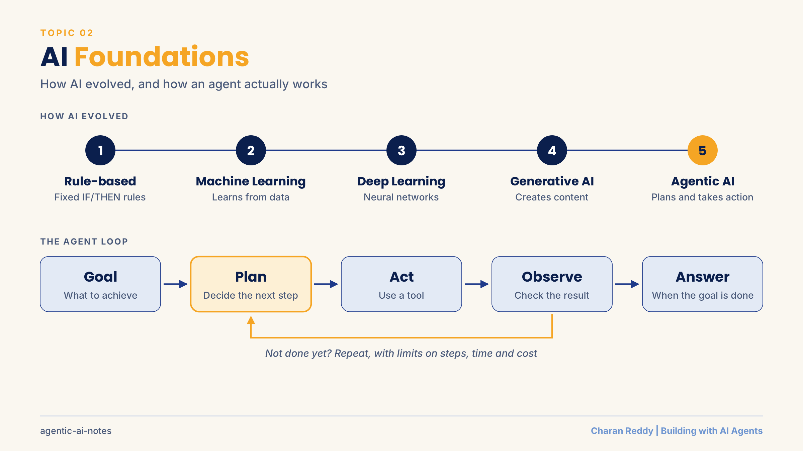
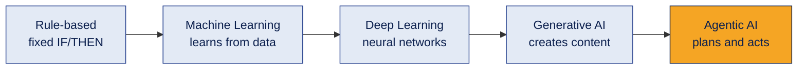
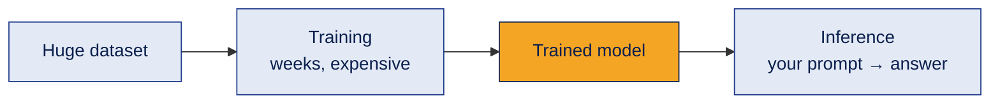
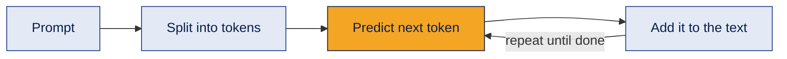
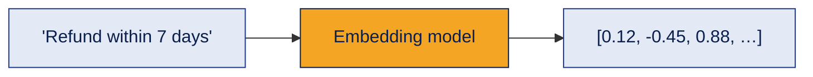
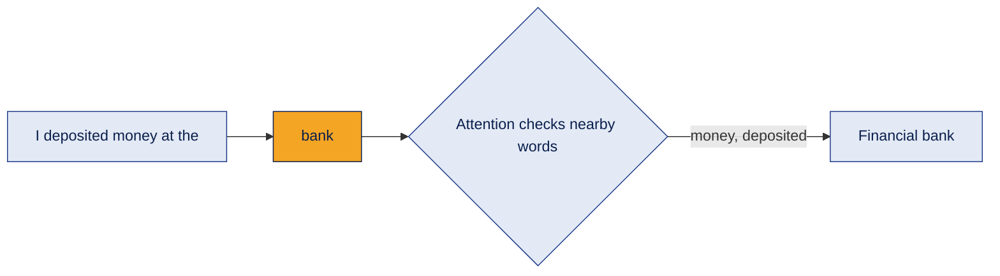
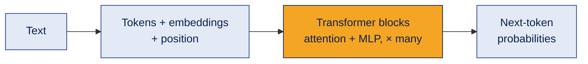
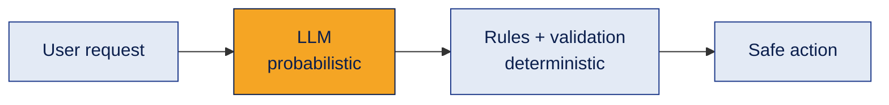
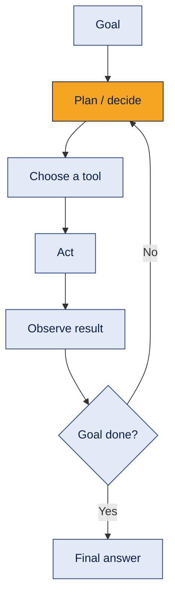
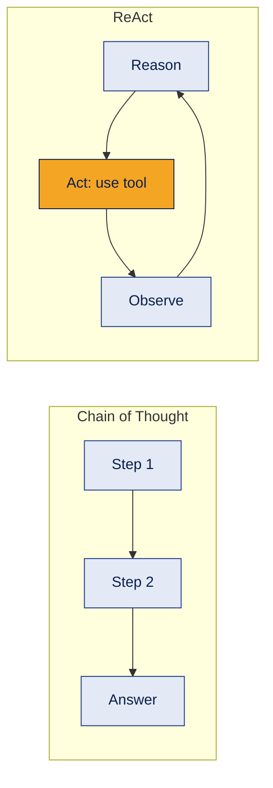

# 02 · AI Foundations

How we got from rule-based software to AI agents, and what is happening inside a large language model.

[← Back to all topics](../README.md)

## Contents
1. [AI → ML → DL → GenAI → Agentic AI](#1-ai--ml--dl--genai--agentic-ai)
2. [Training vs inference](#2-training-vs-inference)
3. [LLMs and tokens](#3-llms-and-tokens)
4. [Embeddings](#4-embeddings)
5. [Attention](#5-attention)
6. [Transformers](#6-transformers)
7. [Temperature, top-k and top-p](#7-temperature-top-k-and-top-p)
8. [Deterministic vs probabilistic](#8-deterministic-vs-probabilistic)
9. [Agentic AI and the agent loop](#9-agentic-ai-and-the-agent-loop)
10. [Chain of Thought vs ReAct](#10-chain-of-thought-vs-react)

---

## 1. AI → ML → DL → GenAI → Agentic AI

**What it is**
The evolution of AI, where each stage solved a limit of the one before.

**How it works**

| Stage | Learns? | Creates content? | Takes actions? |
|---|---|---|---|
| Rule-based | No | No | No |
| Machine learning | Yes | No | No |
| Generative AI | Yes | Yes | No |
| Agentic AI | Yes | Yes | **Yes** |

**Example**
- Rule-based: "Press 1 for billing."
- ML: a spam filter that learned from millions of emails.
- GenAI: ChatGPT writing an ad caption.
- Agentic AI: an agent that finds a lead, checks the CRM, drafts a follow-up and books a call.

**Where it's used**
Knowing the stage tells you the right tool: rules for fixed logic, ML for prediction, GenAI for content, agents for multi-step work.

**Common mistake**
Treating it as a perfect "box inside a box" hierarchy. It's better seen as a progression of capabilities.

**Interview questions**
1. **Q:** Difference between AI and machine learning? **A:** AI is the broad goal of machines doing intelligent tasks; ML is one way to get there, by learning patterns from data.
2. **Q:** What makes deep learning "deep"? **A:** Neural networks with many layers.
3. **Q:** Difference between generative AI and agentic AI? **A:** GenAI creates content when asked; agentic AI plans, uses tools and takes actions toward a goal.
4. **Q:** Give an example where a rule-based system is better than AI. **A:** Fixed, predictable rules like tax calculation or a refund limit: no learning needed and fully explainable.
5. **Q:** Is an AI agent just an LLM? **A:** No. An agent is a system: LLM + tools + memory + workflow + controls.

**In one line**
AI evolved from following rules, to learning, to creating, to acting.

---

## 2. Training vs inference

**What it is**
Training = the model learns from data. Inference = the trained model answers a new request.

**How it works**

**Example**
Like a student: training is years of studying; inference is answering one exam question.

**Where it's used**
As an AI engineer, I mostly work with **inference**: calling an already-trained model through an API. Inference cost and speed (latency) matter a lot in production.

**Common mistake**
Thinking the model learns from every chat. During normal inference the model's weights don't change.

**Interview questions**
1. **Q:** Define training and inference. **A:** Training adjusts the model's parameters using data; inference uses the fixed model to produce outputs.
2. **Q:** Which one happens when you call an LLM API? **A:** Inference.
3. **Q:** Which is more expensive? **A:** Training a large model is far more expensive overall; inference cost adds up per request at scale.
4. **Q:** Does a model learn from my prompts during inference? **A:** Not in its weights. It only uses the prompt as context for that response.
5. **Q:** What is inference latency? **A:** The time between sending a request and getting the response.

**In one line**
Training = learning; inference = using what was learned.

---

## 3. LLMs and tokens

**What it is**
A large language model (LLM) generates text by predicting the most likely **next token** again and again. A token is a piece of text: roughly ¾ of an English word.

**How it works**

**Example**
"Write a tagline for" → "a" → "skincare" → "brand" … each word chosen one token at a time (this is called **autoregressive** generation).

**Where it's used**
Tokens decide **cost** (you pay per token), **limits** (context window size) and **speed**.

**Limits of LLMs**
- Can **hallucinate** (confidently state false things)
- Don't know private company data
- Don't know events after their training cutoff
- Can give different answers to the same prompt

**Common mistake**
Assuming 1 word = 1 token. Long or rare words split into several tokens.

**Interview questions**
1. **Q:** What is a token? **A:** A small unit of text (a word or part of a word) that the model reads and generates.
2. **Q:** How does an LLM generate text? **A:** It predicts the next most likely token repeatedly, adding each one to the context.
3. **Q:** What is hallucination? **A:** When the model produces confident but false or made-up information.
4. **Q:** Why do tokens matter in production? **A:** They determine API cost, context limits and response time.
5. **Q:** How can you reduce hallucinations? **A:** Give relevant context (RAG), clear instructions, allow "I don't know", and validate outputs.

**In one line**
An LLM is a next-token predictor; tokens drive cost, limits and speed.

---

## 4. Embeddings

**What it is**
An embedding turns text into a list of numbers that represents its **meaning**. Similar meanings get similar numbers.

**How it works**

**Example**
"Can I return it?" and "Refund policy" share no words, but their embeddings are close because the meaning is close.

**Where it's used**
Semantic search, RAG, recommendations, grouping similar customer feedback.

**Common mistake**
Thinking embeddings store the text. They store meaning as numbers; the original text is stored separately.

**Interview questions**
1. **Q:** What is an embedding? **A:** A numeric vector that represents the meaning of text.
2. **Q:** Why are embeddings useful? **A:** They let you compare meaning mathematically, enabling search by meaning instead of exact words.
3. **Q:** How is similarity between embeddings measured? **A:** Commonly cosine similarity (how closely two vectors point in the same direction).
4. **Q:** Difference between a token and an embedding? **A:** A token is a piece of text; an embedding is a numeric representation of meaning.
5. **Q:** Can you mix embedding models for documents and queries? **A:** No. Use the same model, otherwise the vectors aren't comparable.

**In one line**
Embeddings = meaning turned into numbers, so computers can compare ideas.

---

## 5. Attention

**What it is**
The mechanism that lets a model decide which words in the input matter most for understanding each word.

**How it works**

**Example**
"I sat on the river **bank**" vs "I deposited money at the **bank**": attention uses the surrounding words to pick the right meaning.

**Where it's used**
Inside every modern LLM. It's why an agent can connect a later step back to an instruction given much earlier.

**Common mistake**
Thinking the model reads strictly word by word like a human. Attention weighs all relevant earlier words at once.

**Interview questions**
1. **Q:** What problem did attention solve? **A:** Older models lost context over long distances; attention links any two words directly.
2. **Q:** Which paper introduced the transformer built on attention? **A:** "Attention Is All You Need" (2017).
3. **Q:** What are Query, Key and Value? **A:** Query = what a word is looking for; Key = what each word offers; Value = the information passed on when they match.
4. **Q:** What is multi-head attention? **A:** Several attention "heads" running in parallel, each capturing different relationships (grammar, meaning, etc.).
5. **Q:** Why does attention matter for agents? **A:** It lets the model keep track of instructions and context across long, multi-step tasks.

**In one line**
Attention = the model focusing on the words that matter for meaning.

---

## 6. Transformers

**What it is**
The neural network architecture behind modern LLMs, built around attention.

**How it works**

- **Embedding layer:** turns tokens into vectors and adds their position.
- **Transformer blocks:** attention lets tokens share context; an MLP refines each token. Stacked many times.
- **Output:** a probability for every possible next token.

**Example**
GPT-2 (small) has 12 transformer blocks and about 124 million parameters. Modern models are far larger.

**Where it's used**
GPT, Claude, Gemini, Llama: all transformer-based. An LLM is a transformer trained on massive text.

**Common mistake**
Mixing up the terms: attention is the technique, the transformer is the architecture, the LLM is a trained transformer.

**Interview questions**
1. **Q:** What is a transformer? **A:** A neural network architecture that uses attention to process all tokens in parallel.
2. **Q:** Why did transformers replace older sequence models (RNNs)? **A:** They process tokens in parallel (faster training) and handle long-range context better.
3. **Q:** What is positional encoding? **A:** Information added to embeddings so the model knows word order.
4. **Q:** What are parameters? **A:** The learned internal numbers (weights) of a model.
5. **Q:** How are attention, transformers and LLMs related? **A:** Attention is the core technique; transformers are built around it; LLMs are large transformers trained on huge text.

**In one line**
Attention → transformer → trained at scale → LLM.

---

## 7. Temperature, top-k and top-p

**What it is**
Settings that control how the model picks the next token from its probabilities.

**How it works**
| Setting | What it does | Low value | High value |
|---|---|---|---|
| Temperature | Sharpens or flattens probabilities | Predictable, consistent | Creative, more random |
| Top-k | Only consider the k most likely tokens | Safer | More variety |
| Top-p | Only consider tokens adding up to probability p | Safer | More variety |

**Example**
- Classifying support tickets → temperature 0 to 0.2 (consistent).
- Brainstorming ad hooks → temperature 0.8 to 1.0 (varied).

**Where it's used**
Set in every LLM API call. Agents doing business logic usually use low temperature.

**Common mistake**
Thinking temperature 0 guarantees identical answers every time. It makes output much more consistent, but small variations can still happen.

**Interview questions**
1. **Q:** What does temperature control? **A:** The randomness of token selection.
2. **Q:** What temperature would you use for data extraction? **A:** Low (around 0), for consistent output.
3. **Q:** Difference between top-k and top-p? **A:** Top-k keeps a fixed number of tokens; top-p keeps however many tokens reach a probability threshold.
4. **Q:** Does high temperature make the model smarter? **A:** No, only more varied, and more likely to go off track.
5. **Q:** Should you tune temperature and top-p heavily at the same time? **A:** Usually adjust one at a time, otherwise it's hard to know which change caused what.

**In one line**
Low temperature = consistent, high temperature = creative.

---

## 8. Deterministic vs probabilistic

**What it is**
- **Deterministic:** the same input always gives the same output.
- **Probabilistic:** the output is based on probabilities and can vary.

**How it works**

**Example**
`2 + 2 = 4` is deterministic. An LLM writing a product description is probabilistic.

**Where it's used**
Production AI wraps **probabilistic models inside deterministic controls**: the LLM suggests a refund, but a fixed rule decides if it needs human approval.

**Common mistake**
Letting the LLM make final decisions on money, permissions or irreversible actions without deterministic checks.

**Interview questions**
1. **Q:** Is an LLM deterministic? **A:** No, it's probabilistic: outputs can vary.
2. **Q:** Give an example of a deterministic component in an AI system. **A:** A validation rule, a calculator tool, a database query, a permission check.
3. **Q:** Why combine both? **A:** The LLM handles flexible language; deterministic code guarantees rules and safety.
4. **Q:** How do you make LLM output more predictable? **A:** Low temperature, clear instructions, structured output formats and validation.
5. **Q:** Where should deterministic logic decide instead of the LLM? **A:** Payments, permissions, compliance rules and anything irreversible.

**In one line**
Probabilistic intelligence inside deterministic boundaries.

---

## 9. Agentic AI and the agent loop

**What it is**
An AI agent is a **system** that pursues a goal by planning, using tools, observing results and deciding what to do next.

> **AI agent = model + tools + data + workflow + memory/state + controls**

**How it works**

**Controls every agent needs**
Permissions · max steps · timeouts · retry limits · cost limits · human approval for risky actions.

**Example**
Goal: "Find why our CPL went up this week." The agent pulls campaign data → compares weeks → spots rising CPC on one ad set → checks frequency → reports "ad fatigue, refresh creatives".

**Where it's used**
Customer support, lead qualification, research, reporting, coding assistants, workflow automation.

**Common mistake**
Building an agent where a simple fixed workflow would do. If the steps never change, use a workflow: it's cheaper and more reliable.

**Interview questions**
1. **Q:** What makes a system "agentic"? **A:** It can plan, choose tools, take actions and adjust based on results toward a goal.
2. **Q:** What are the core parts of an agent? **A:** LLM, tools, memory/state, orchestration logic and controls.
3. **Q:** Agent vs workflow: when would you NOT use an agent? **A:** When the steps are fixed and predictable; a workflow is cheaper, faster and more reliable.
4. **Q:** Why does an agent need a max-steps limit? **A:** To prevent infinite loops and runaway cost.
5. **Q:** What is tool calling? **A:** The LLM choosing a function and its inputs; the system runs it and returns the result to the LLM.

**In one line**
An agent is a loop: plan → act → observe → repeat, with controls around it.

---

## 10. Chain of Thought vs ReAct

**What it is**
- **Chain of Thought (CoT):** the model reasons step by step before answering.
- **ReAct (Reason + Act):** the model reasons, takes an action with a tool, observes the result, and reasons again.

**How it works**

**Example**
- CoT: "Calculate the discount step by step."
- ReAct: "What's the weather in Hyderabad?" → reason: I need live data → act: call weather tool → observe: 31°C → answer.

**Where it's used**
CoT for logic and calculations. ReAct is the pattern behind most tool-using agents.

**Common mistake**
Expecting CoT alone to know live facts. Reasoning can't replace missing data: that needs tools (ReAct) or retrieval (RAG).

**Interview questions**
1. **Q:** What is Chain of Thought prompting? **A:** Asking the model to reason through intermediate steps before the final answer.
2. **Q:** What does ReAct stand for? **A:** Reasoning + Acting.
3. **Q:** Key difference between CoT and ReAct? **A:** CoT only reasons internally; ReAct interleaves reasoning with tool actions and observations.
4. **Q:** When would you use ReAct over CoT? **A:** When the task needs external information or actions (search, database, APIs).
5. **Q:** Name a risk of ReAct agents. **A:** Looping or choosing wrong tools: they need step limits and good tool descriptions.

**In one line**
CoT thinks in steps; ReAct thinks, acts with tools, and checks the result.

[← Back to all topics](../README.md)
