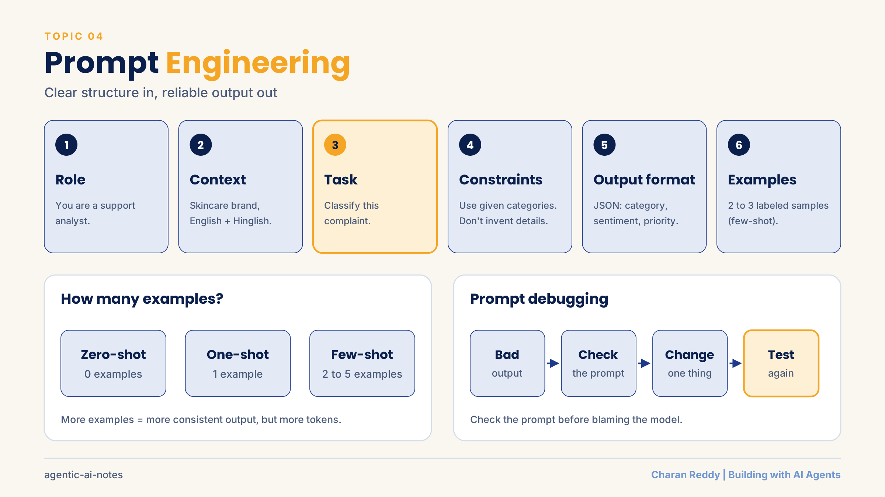
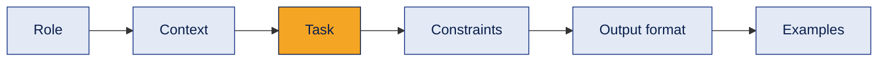
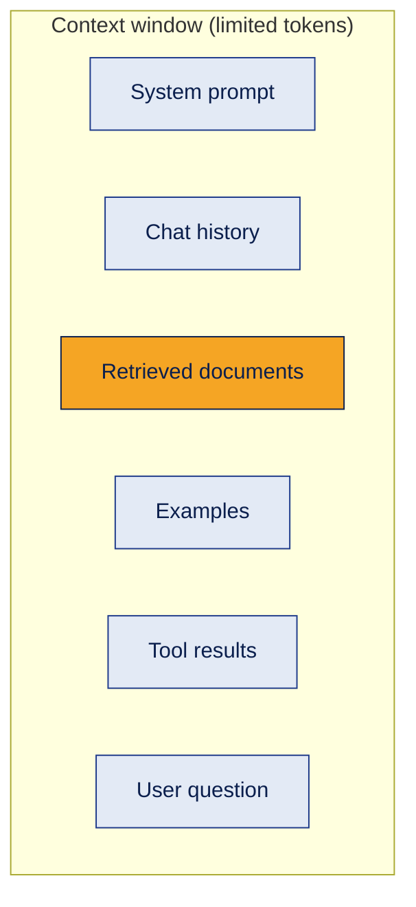
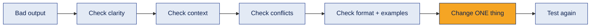
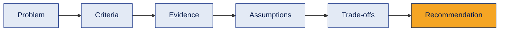
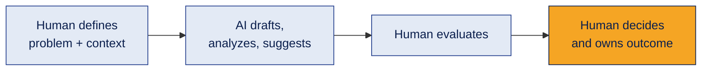

# 04 · Prompt Engineering



Designing instructions, context, constraints and examples so a model clearly understands the task, and fixing prompts systematically when outputs go wrong.

[← Back to all topics](../README.md)

## Contents
1. [Anatomy of a strong prompt](#1-anatomy-of-a-strong-prompt)
2. [Context window and rate limits](#2-context-window-and-rate-limits)
3. [Zero-shot, one-shot, few-shot](#3-zero-shot-one-shot-few-shot)
4. [Prompt debugging](#4-prompt-debugging)
5. [Structured reasoning for decisions](#5-structured-reasoning-for-decisions)
6. [AI assists, humans decide](#6-ai-assists-humans-decide)

---

## 1. Anatomy of a strong prompt

**What it is**
A clear structure that removes guesswork for the model.

**How it works**


**Example**
```text
Role: You are a customer support analyst.
Context: We are an online skincare brand. Customers write in English and Hinglish.
Task: Classify the complaint below.
Constraints: Use only the categories given. Don't invent details.
Output format: JSON with "category", "sentiment", "priority".
Categories: Delivery, Refund, Product quality, Other.

Complaint: "Order aaya hi nahi, 10 din ho gaye!"
```

**Where it's used**
System prompts for agents, tool descriptions, classification, extraction, content generation.

**Common mistake**
One vague line like "Summarize this": the model has to guess the audience, length and format.

**Interview questions**
1. **Q:** What are the parts of a good prompt? **A:** Role, context, task, constraints, output format and (if needed) examples.
2. **Q:** What is a system prompt? **A:** Background instructions that set the model's role and rules for the whole conversation.
3. **Q:** Why specify an output format? **A:** So the result is consistent and other code can parse it (e.g. JSON).
4. **Q:** How do you reduce made-up answers through the prompt? **A:** Tell the model to use only the given context and to say "I don't know" when unsure.
5. **Q:** Does a longer prompt always perform better? **A:** No. Clearer and more relevant beats longer.

**In one line**
Role → context → task → constraints → format → examples.

---

## 2. Context window and rate limits

**What it is**
- **Context window:** everything the model can consider at once: system prompt, chat history, documents, examples, tool results.
- **RPM / TPM:** API limits on **requests per minute** and **tokens per minute**.

**How it works**


**Example**
Pasting a whole 300-page manual can exceed the window or bury the answer. Sending only the 3 most relevant sections works better (that's what RAG does).

**Where it's used**
Designing RAG, managing long chats, planning costs, and scaling apps under API limits.

**Common mistake**
"More context = better answers." **Relevant** context beats more context.

**Interview questions**
1. **Q:** What is a context window? **A:** The maximum number of tokens a model can process in one request, including input and output.
2. **Q:** What happens when you exceed it? **A:** The request fails or older content must be trimmed/summarized.
3. **Q:** What do RPM and TPM mean? **A:** Requests per minute and tokens per minute: API rate limits.
4. **Q:** How do you handle long conversations? **A:** Summarize older messages, keep only relevant history, or store memory externally.
5. **Q:** Why does relevant context matter more than more context? **A:** Irrelevant text adds cost and noise, and can distract the model from the key information.

**In one line**
The context window is limited: fill it with what matters, not with everything.

---

## 3. Zero-shot, one-shot, few-shot

**What it is**
How many examples you give the model before the real task.

**How it works**
| Method | Examples | Use when |
|---|---|---|
| Zero-shot | 0 | Task is simple and common |
| One-shot | 1 | You need to show a format |
| Few-shot | 2 to 5 | Output must follow a specific style or labeling pattern |

**Example (few-shot)**
```text
"Delivered in 2 days, love it!" → Positive
"Box was damaged." → Negative
"It's okay." → Neutral
"Packaging was great but the cream smells weird." →
```

**Where it's used**
Classification, extraction and brand-tone writing: anywhere consistent output matters.

**Common mistake**
Biased examples. If all examples are Positive, the model leans Positive. Keep examples balanced and varied.

**Interview questions**
1. **Q:** What is zero-shot prompting? **A:** Asking the model to do a task with no examples.
2. **Q:** When would you use few-shot? **A:** When you need a specific format, labels or style the model doesn't follow reliably without examples.
3. **Q:** What's a risk of few-shot prompting? **A:** Examples can bias the output and add token cost.
4. **Q:** How many examples are typical for few-shot? **A:** Usually 2 to 5 good, varied examples.
5. **Q:** Few-shot prompting vs fine-tuning? **A:** Few-shot teaches through examples in the prompt (no training); fine-tuning changes the model's weights with training data.

**In one line**
Show 0, 1 or a few examples depending on how much guidance the model needs.

---

## 4. Prompt debugging

**What it is**
Fixing bad outputs systematically, checking the prompt before blaming the model.

**How it works**


**Common prompt problems**
Ambiguity · missing context · conflicting instructions ("be detailed" + "keep it short") · unclear constraints · biased or poor examples · no output format · over-constraining.

**Example**
Output too generic → the prompt never said who the audience is → add "for first-time buyers aged 25 to 35" → test again.

**Where it's used**
Every AI feature before launch, and whenever quality drops in production.

**Common mistake**
Rewriting the entire prompt randomly. Change one thing, test, compare.

**Interview questions**
1. **Q:** An LLM gives wrong outputs. What do you check first? **A:** The prompt: clarity, context, conflicting instructions, format and examples.
2. **Q:** Give an example of conflicting instructions. **A:** "Be very detailed" and "answer in one sentence" in the same prompt.
3. **Q:** Why change only one thing at a time? **A:** So you know exactly which change fixed (or broke) the output.
4. **Q:** How do you test a prompt properly? **A:** Run it on a set of varied test inputs, including tricky ones, and compare results.
5. **Q:** When is the problem not the prompt? **A:** When the model lacks the needed knowledge (needs RAG/tools) or the task needs a different model.

**In one line**
Debug the prompt systematically before blaming the model.

---

## 5. Structured reasoning for decisions

**What it is**
A template that makes AI (and people) reason through a decision instead of guessing.

**How it works**


**Example**
"Which feature should we build next: one-click checkout or a loyalty program?"
- **Criteria:** revenue impact, effort, risk, strategy fit
- **Evidence:** analytics showing high drop-off at checkout, support tickets, engineering estimates
- **Assumptions:** one-click checkout *may* reduce abandonment (not yet proven)
- **Trade-offs:** checkout = faster win; loyalty = bigger long-term impact, more effort
- **Recommendation:** checkout first, because the evidence points to it

**Where it's used**
Product decisions, business recommendations, and prompting agents for analysis tasks.

**Common mistake**
Mixing evidence with assumptions. Label what is proven and what is believed.

**Interview questions**
1. **Q:** Why use a structured reasoning template with an LLM? **A:** It forces clear criteria and evidence, making recommendations more reliable and explainable.
2. **Q:** Difference between evidence and an assumption? **A:** Evidence is supported by data; an assumption is believed but not yet proven.
3. **Q:** What are trade-offs? **A:** What you gain and give up with each option.
4. **Q:** How is this related to Chain of Thought? **A:** It's a guided, structured form of step-by-step reasoning.
5. **Q:** Why ask the model to list assumptions? **A:** So humans can verify them before acting on the recommendation.

**In one line**
Separate evidence from assumptions before recommending anything.

---

## 6. AI assists, humans decide

**What it is**
A working model for using AI in real jobs: AI speeds up drafts and analysis; the human stays responsible.

**How it works**


**Example**
AI drafts five ad copy variations; the marketer checks brand fit and claims, picks two, and owns the campaign result.

**Where it's used**
Product management, marketing, analysis, coding with AI assistants.

**Common mistake**
Accepting AI output without checking it. Accountability doesn't move to the AI.

**Interview questions**
1. **Q:** What should humans keep responsibility for when using AI? **A:** Defining the problem, evaluating outputs, making decisions and owning outcomes.
2. **Q:** Where does AI add the most value in knowledge work? **A:** First drafts, summarizing, analysis and generating options quickly.
3. **Q:** How do you verify AI output? **A:** Check facts against sources, test with real cases, and review for errors or bias.
4. **Q:** Why is accountability important with AI? **A:** AI can be confidently wrong; a responsible human must check and own decisions.
5. **Q:** How would you introduce AI into a team's workflow? **A:** Start with low-risk tasks, keep human review, measure results, then expand.

**In one line**
AI accelerates the work; humans own the decisions.

[← Back to all topics](../README.md)
