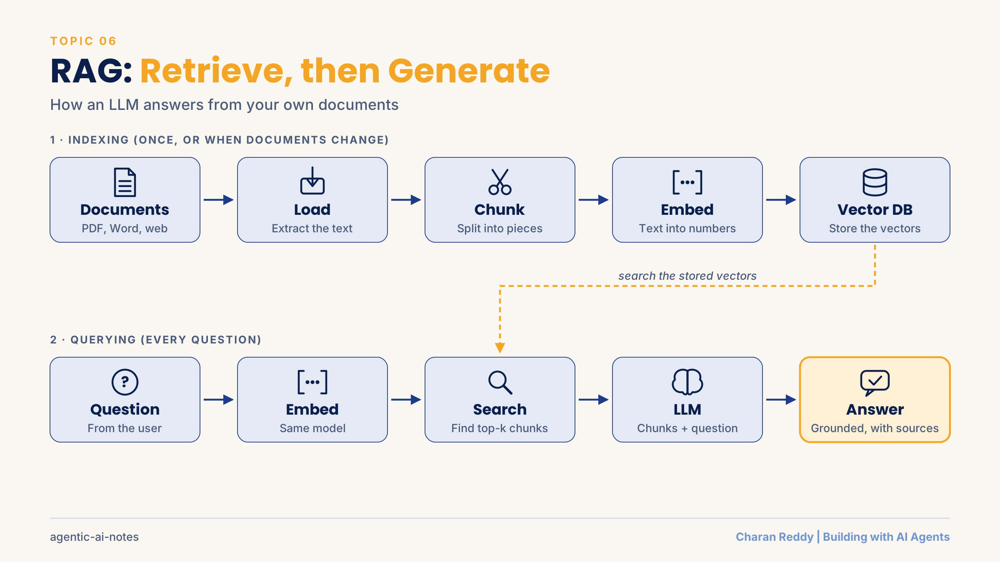
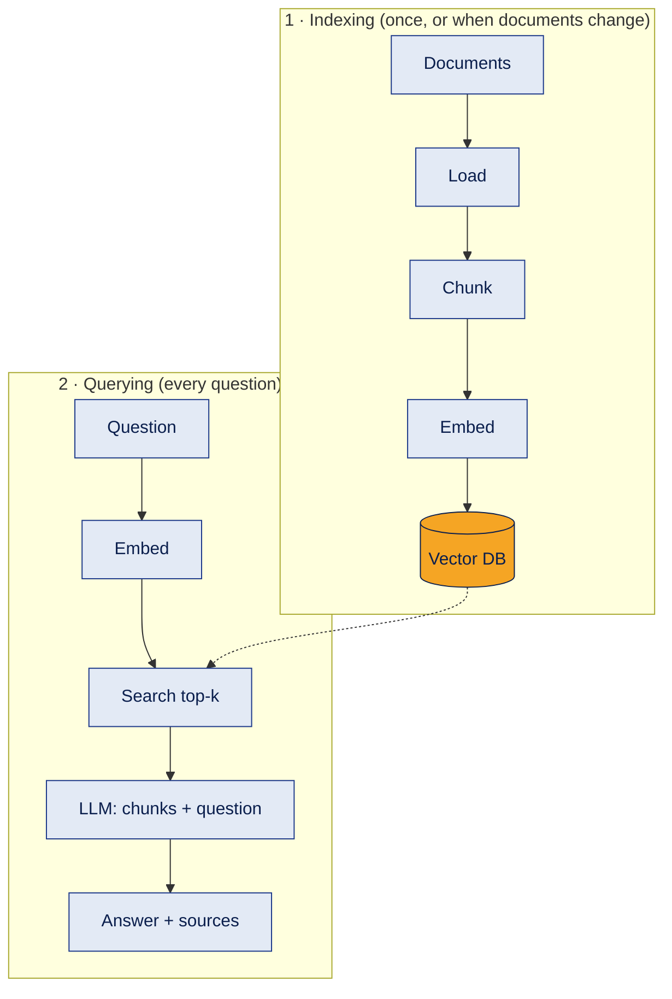
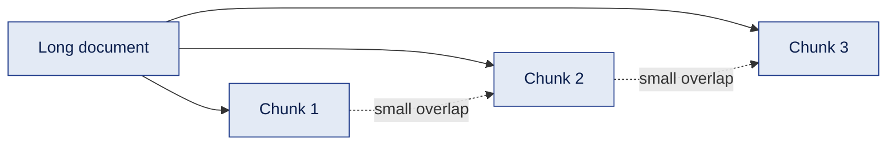
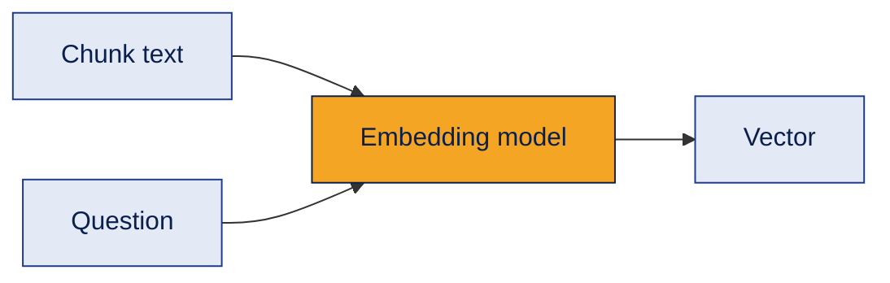
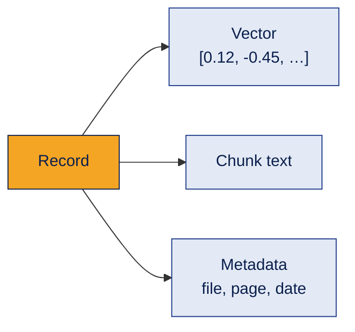
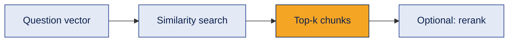
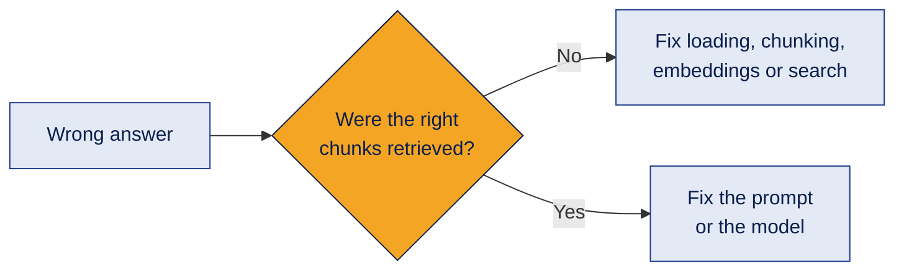

# 06 · RAG (Retrieval-Augmented Generation)



How to make an LLM answer from **your own documents**, by retrieving the right information first and generating the answer second.

> **Status:** 📘 Concepts learned · hands-on project next.

[← Back to all topics](../README.md)

## Contents
1. [What RAG is](#1-what-rag-is)
2. [Loading documents](#2-loading-documents)
3. [Chunking](#3-chunking)
4. [Embeddings for RAG](#4-embeddings-for-rag)
5. [Vector databases](#5-vector-databases)
6. [Retrieval](#6-retrieval)
7. [Generation and grounding](#7-generation-and-grounding)
8. [RAG vs fine-tuning](#8-rag-vs-fine-tuning)
9. [RAG patterns and debugging](#9-rag-patterns-and-debugging)
10. [Full pipeline in code](#10-full-pipeline-in-code)

---

## 1. What RAG is

**What it is**
A pattern where the system **searches your documents first**, then gives the most relevant pieces to the LLM to write the answer.

**How it works**


**Example**
A customer asks "Can I return an opened serum?" → the system finds the return-policy section → the LLM answers using that text and cites it.

**Where it's used**
Company knowledge bots, customer support, HR/policy assistants, document Q&A, research tools.

**Common mistake**
Thinking RAG teaches the model permanently. It only supplies context for each answer; the model itself doesn't change.

**Interview questions**
1. **Q:** What is RAG? **A:** Retrieving relevant information from a knowledge source and adding it to the prompt so the LLM answers from it.
2. **Q:** What problems does RAG solve? **A:** Missing private or up-to-date knowledge, and hallucination: answers become grounded in real sources.
3. **Q:** What are the two phases of RAG? **A:** Indexing (load, chunk, embed, store) and querying (embed question, retrieve, generate).
4. **Q:** Who finds the information and who writes the answer? **A:** The retriever finds it; the LLM writes the answer.
5. **Q:** Can RAG show sources? **A:** Yes. Chunks keep metadata (file, page), so answers can cite where they came from.

**In one line**
Retrieve first, generate second.

---

## 2. Loading documents

**What it is**
Extracting text (and metadata like file name and page number) from source files.

**How it works**
| Source | Example LangChain loader |
|---|---|
| PDF | `PyPDFLoader` |
| Word (.docx) | `Docx2txtLoader` |
| CSV | `CSVLoader` |
| Web page | `WebBaseLoader` |

**Example**
Loading a 40-page refund policy PDF gives 40 documents (one per page), each tagged with its page number.

**Where it's used**
The first step of every RAG pipeline. In no-code setups, tools like n8n can load files from Google Drive automatically.

**Common mistake**
Scanned PDFs are images: a normal loader returns empty text. They need OCR first. Tables also often come out messy.

**Interview questions**
1. **Q:** What does a document loader do? **A:** Reads a file and returns its text plus metadata.
2. **Q:** Why keep metadata like page numbers? **A:** For citations, filtering and debugging which source an answer came from.
3. **Q:** What's the problem with scanned PDFs? **A:** They contain images, not text, so they need OCR before loading.
4. **Q:** How would you keep a RAG system updated with new files? **A:** Re-index new or changed files on a schedule or when a file changes.
5. **Q:** Why can tables be tricky? **A:** Simple text extraction can break their structure, mixing up rows and columns.

**In one line**
Good answers start with clean text extracted from the right files.

---

## 3. Chunking

**What it is**
Splitting documents into smaller pieces before embedding them.

**How it works**

- A common starting point: about 500 to 1,000 characters per chunk, with 10 to 20% overlap.
- **Too big:** search becomes vague, and you send unnecessary text (cost).
- **Too small:** chunks lose meaning.
- Better: split on headings and paragraphs, not only a fixed character count.

**Example**
A refund policy split so "Returns within 7 days" and its conditions stay in the same chunk.

**Where it's used**
Every RAG system. Chunking quality often matters more than which LLM you use.

**Common mistake**
No overlap, so an important sentence gets cut in half across two chunks.

**Interview questions**
1. **Q:** Why chunk documents? **A:** Smaller pieces give more precise search and let you send only relevant text to the LLM.
2. **Q:** What is chunk overlap for? **A:** To keep context that would otherwise be split across chunk boundaries.
3. **Q:** What happens if chunks are too large? **A:** Less precise retrieval, more irrelevant text, higher cost.
4. **Q:** What happens if chunks are too small? **A:** Each chunk lacks enough context to be useful.
5. **Q:** What is structure-aware chunking? **A:** Splitting on natural boundaries like headings, sections and paragraphs.

**In one line**
Chunk size and boundaries decide what the retriever can find.

---

## 4. Embeddings for RAG

**What it is**
Converting each chunk (and later, each question) into a vector that represents its meaning.

**How it works**

- **Tokens vs embeddings:** tokenization happens inside the model automatically; tokens matter for limits and cost. The embedding is the output: meaning as numbers.
- Use the **same embedding model** for chunks and questions.

**Example**
"Can I return it?" lands close to "Refund within 7 days" in vector space, even with no shared words.

**Where it's used**
Indexing every chunk and embedding every incoming question.

**Common mistake**
Changing the embedding model without re-indexing: old and new vectors can't be compared.

**Interview questions**
1. **Q:** Why embed both chunks and the question? **A:** So they're in the same vector space and can be compared by meaning.
2. **Q:** What happens if you switch embedding models? **A:** You must re-embed all documents; vectors from different models aren't comparable.
3. **Q:** Do you tokenize text yourself before embedding? **A:** No. The embedding model tokenizes internally.
4. **Q:** Name embedding model options. **A:** Hosted models (e.g. OpenAI embeddings) or open-source models from Hugging Face.
5. **Q:** What does embedding dimension mean? **A:** The length of the vector (e.g. hundreds to a few thousand numbers).

**In one line**
Same embedding model for documents and questions, always.

---

## 5. Vector databases

**What it is**
A database built to store vectors and quickly find the ones most similar to a query.

**How it works**
Each record stores three things:


| Option | Good for |
|---|---|
| Chroma, FAISS | Learning and prototypes, run locally |
| Pinecone | Managed cloud service |
| Qdrant, Weaviate | Open-source, production |
| pgvector | Adding vectors to an existing PostgreSQL database |

**Example**
Storing 2,000 policy chunks in Chroma on a laptop for a prototype; moving to a managed service for production.

**Where it's used**
The memory/knowledge store of RAG systems and agents.

**Common mistake**
Re-creating the database on every run. Persist it and load it next time.

**Interview questions**
1. **Q:** What is a vector database? **A:** A database optimized to store embeddings and search them by similarity.
2. **Q:** What is stored alongside each vector? **A:** The original chunk text and metadata.
3. **Q:** Why not use a normal SQL database for semantic search? **A:** Standard SQL isn't built for fast similarity search over vectors (extensions like pgvector add it).
4. **Q:** Name a local and a managed vector DB. **A:** Local: Chroma or FAISS. Managed: Pinecone.
5. **Q:** How does metadata help? **A:** It enables filtering (e.g. only 2026 documents) and citations.

**In one line**
A vector DB stores meaning and finds the closest matches fast.

---

## 6. Retrieval

**What it is**
Finding the chunks most relevant to the question.

**How it works**


| Term | Meaning |
|---|---|
| Similarity | How close two vectors are (often cosine similarity) |
| Top-k | Number of chunks returned (often 3 to 5) |
| Metadata filter | Restrict search (e.g. one product line) |
| Hybrid search | Keyword + semantic search together |
| Reranking | Re-sorting results with a stronger model to put the best first |

**Example**
Question about "return window" → top 3 chunks: return policy, exceptions, how to request a return.

**Where it's used**
The core of RAG quality: if retrieval is wrong, the answer will be wrong.

**Common mistake**
Pure semantic search for exact terms like product codes ("SKU-4471"). Hybrid search handles exact matches better.

**Interview questions**
1. **Q:** What is top-k? **A:** The number of most-similar chunks retrieved for a query.
2. **Q:** What is cosine similarity? **A:** A measure of how similar two vectors' directions are, commonly used for comparing embeddings.
3. **Q:** What is hybrid search? **A:** Combining keyword search with semantic (vector) search.
4. **Q:** What does a reranker do? **A:** Re-scores retrieved chunks so the most relevant ones come first.
5. **Q:** What's the trade-off in choosing k? **A:** Too low may miss information; too high adds noise and cost.

**In one line**
Retrieval quality decides answer quality.

---

## 7. Generation and grounding

**What it is**
Sending the retrieved chunks and the question to the LLM, with instructions to answer **only** from that context.

**How it works**
```text
Answer the question using only the context below.
If the answer is not in the context, say "I don't know."
Cite the source for each fact.

Context:
<retrieved chunks>

Question: <user question>
```

**Example**
"Returns are accepted within 7 days if unopened (Refund Policy, page 2)."

**Where it's used**
The final step of RAG; also used by agents when they call a search tool.

**Common mistake**
No "I don't know" instruction: when retrieval misses, the model fills the gap with a made-up answer.

**Interview questions**
1. **Q:** What is grounding? **A:** Making the model base its answer on provided sources rather than its general memory.
2. **Q:** How do you reduce hallucinations in RAG? **A:** Instruct it to use only the context, allow "I don't know", cite sources, and improve retrieval.
3. **Q:** Why use low temperature for RAG answers? **A:** For consistent, factual answers.
4. **Q:** How do citations help? **A:** Users can verify answers, and developers can debug which chunk was used.
5. **Q:** What if the retrieved chunks contradict each other? **A:** Ask the model to flag the conflict and prefer the most recent/authoritative source (using metadata).

**In one line**
Answer only from the retrieved context, and say "I don't know" otherwise.

---

## 8. RAG vs fine-tuning

**What it is**
Two different ways to customize an LLM.

**How it works**
| | RAG | Fine-tuning |
|---|---|---|
| Changes | What the model **knows** for each answer | How the model **behaves** |
| Best for | Facts, policies, changing documents | Style, format, specialized task patterns |
| Updating | Easy: add or replace documents | Slower and costlier: retrain |
| Shows sources | Yes | No |

> Prompting = change instructions · RAG = supply knowledge · Fine-tuning = adapt behavior

Common fine-tuning terms: **SFT** (supervised fine-tuning), **PEFT** (training only a small part), **LoRA** (small adapter weights), **QLoRA** (LoRA on a compressed model).

**Example**
- Current refund policy → RAG.
- Always replying in the brand's exact tone and JSON format → fine-tuning (if prompting isn't enough).

**Where it's used**
Choosing the right approach before building. Most business assistants start with prompting + RAG.

**Common mistake**
Fine-tuning to add frequently changing facts: every update would need retraining.

**Interview questions**
1. **Q:** RAG vs fine-tuning: what's the key difference? **A:** RAG supplies external knowledge at query time; fine-tuning changes the model's behavior through training.
2. **Q:** Your company policies change monthly. Which approach? **A:** RAG, because you can update documents without retraining.
3. **Q:** When is fine-tuning a good choice? **A:** For consistent style/format or specialized task behavior that prompting can't achieve.
4. **Q:** What is LoRA? **A:** A fine-tuning method that trains small adapter weights instead of the full model, saving cost.
5. **Q:** Can RAG and fine-tuning be combined? **A:** Yes. Fine-tune for behavior, RAG for current knowledge.

**In one line**
RAG for knowledge, fine-tuning for behavior. Start with RAG.

---

## 9. RAG patterns and debugging

**What it is**
Variations of RAG for harder problems, and how to fix a RAG system that gives wrong answers.

**How it works**
| Pattern | Idea |
|---|---|
| Basic RAG | Retrieve top-k, generate |
| Hybrid RAG | Keyword + semantic retrieval |
| Agentic RAG | An agent decides when/where to search and which tool to use |
| Corrective RAG | Check retrieval quality; if weak, rewrite the query and search again |
| Graph RAG | Use entities and relationships (knowledge graphs) |
| Multimodal RAG | Retrieve across text, images, tables, audio |



**Example**
An agentic RAG router: policy questions → PDF vector search; current pricing questions → web search.

**Where it's used**
Moving from a demo to a reliable system.

**Common mistake**
Blaming the LLM first. Print the retrieved chunks: most RAG failures are retrieval or ingestion problems.

**Interview questions**
1. **Q:** What is agentic RAG? **A:** RAG where an agent decides when to retrieve, from which source, and whether to retry.
2. **Q:** What is corrective RAG? **A:** A loop that evaluates retrieved results and re-searches (e.g. with a rewritten query) if they're weak.
3. **Q:** Your RAG gives wrong answers. How do you debug? **A:** Check retrieved chunks first; if wrong, fix ingestion/chunking/embeddings/search; if right, fix the prompt.
4. **Q:** How do you evaluate a RAG system? **A:** A test set of questions with known answers, measuring retrieval relevance and answer faithfulness.
5. **Q:** What is faithfulness? **A:** Whether the answer sticks to the retrieved sources without adding unsupported claims.

**In one line**
Debug retrieval before the model; upgrade the pattern only when basic RAG isn't enough.

---

## 10. Full pipeline in code

A minimal RAG pipeline with LangChain and Chroma (an illustration, so check current docs before running):

```python
# pip install langchain-community langchain-openai langchain-chroma langchain-text-splitters pypdf
from langchain_community.document_loaders import PyPDFLoader
from langchain_text_splitters import RecursiveCharacterTextSplitter
from langchain_openai import OpenAIEmbeddings, ChatOpenAI
from langchain_chroma import Chroma

# 1. Load
docs = PyPDFLoader("refund_policy.pdf").load()

# 2. Chunk (sizes are characters here, not tokens)
splitter = RecursiveCharacterTextSplitter(chunk_size=1000, chunk_overlap=150)
chunks = splitter.split_documents(docs)

# 3 to 5. Embed + store (saved to disk so it isn't rebuilt every run)
db = Chroma.from_documents(chunks, OpenAIEmbeddings(model="text-embedding-3-small"),
                           persist_directory="./my_db")

# 6. Retrieve
question = "How many days do I have to ask for a refund?"
hits = db.similarity_search(question, k=3)
context = "\n\n".join(h.page_content for h in hits)

# 7. Generate (grounded)
llm = ChatOpenAI(model="gpt-4o-mini", temperature=0)
answer = llm.invoke(
    "Answer only from the context. If it's not there, say you don't know.\n\n"
    f"Context:\n{context}\n\nQuestion: {question}"
)
print(answer.content)
print([h.metadata for h in hits])   # sources: file + page
```

**API key:** stored in a `.env` file as `OPENAI_API_KEY`, never in the code or on GitHub.

[← Back to all topics](../README.md)
