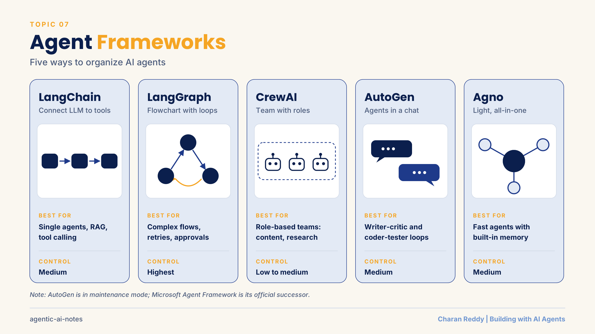
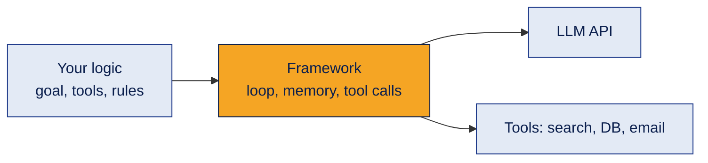
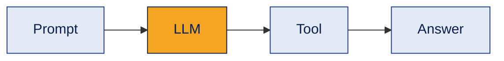
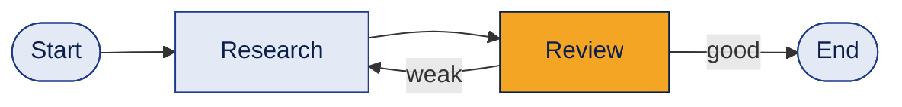
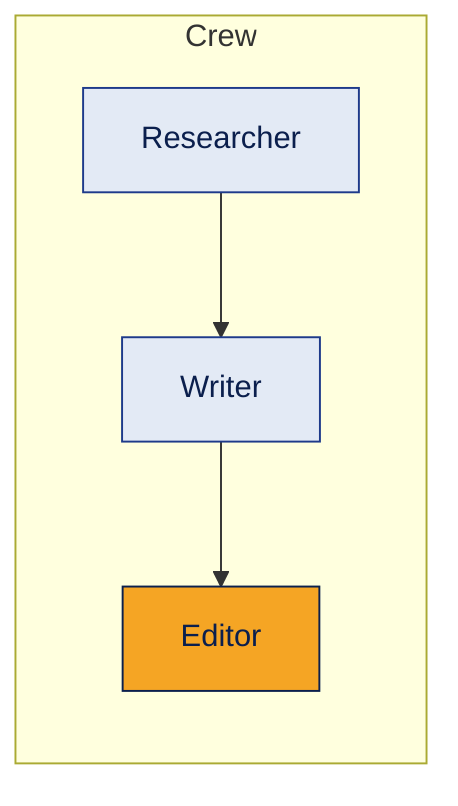
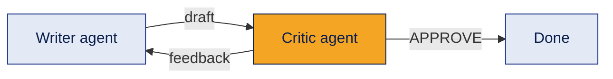
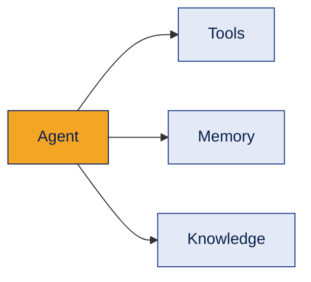
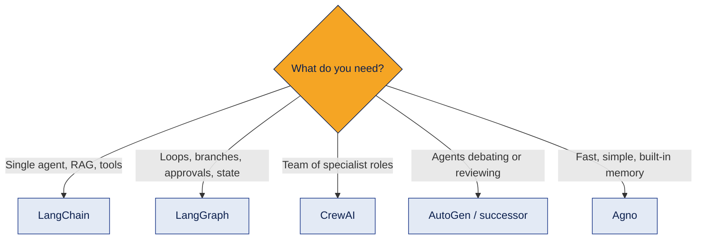

# 07 · Agent Frameworks



The main Python frameworks for building AI agents: what each one is, how it thinks about a problem, and when to choose it.

> **Status:** 📘 Concepts learned · hands-on projects next. Code examples here are short illustrations of each framework's style; framework APIs change often, so always check the official docs for the current version.

[← Back to all topics](../README.md)

## Contents
1. [What an agent framework does](#1-what-an-agent-framework-does)
2. [LangChain](#2-langchain)
3. [LangGraph](#3-langgraph)
4. [CrewAI](#4-crewai)
5. [AutoGen](#5-autogen)
6. [Agno](#6-agno)
7. [Choosing a framework](#7-choosing-a-framework)

**One example used throughout:** a skincare brand wants AI to research a trend, write a LinkedIn post, and check it before publishing.

---

## 1. What an agent framework does

**What it is**
A ready-made Python toolkit that handles the plumbing of agents (connecting to LLMs, defining tools, managing memory and running the agent loop), so you focus on the logic.

**How it works**


**Example**
Without a framework you'd hand-write the loop: call the LLM, parse its tool request, run the tool, send the result back, repeat. A framework does that for you.

**Where it's used**
The orchestration layer of the GenAI stack.

**Common mistake**
Learning frameworks before the concepts. Frameworks change; the concepts (tools, loops, state, memory) stay.

**Interview questions**
1. **Q:** Why use an agent framework instead of raw API calls? **A:** It provides tested building blocks for tool calling, memory, state and multi-step flows, saving time.
2. **Q:** Which stack layer do agent frameworks belong to? **A:** Orchestration.
3. **Q:** Can you build an agent without a framework? **A:** Yes, with direct LLM API calls and your own loop; frameworks just make it faster.
4. **Q:** What's a downside of frameworks? **A:** Extra abstraction can hide what's happening and make debugging harder; APIs change often.
5. **Q:** What concepts stay the same across frameworks? **A:** LLM, tools, state/memory, the agent loop, and controls like step limits.

**In one line**
Frameworks handle the agent plumbing so you can focus on the logic.

---

## 2. LangChain

**What it is**
A Python framework for connecting LLMs to prompts, tools, data and memory. Best for a single agent or straightforward flows.

**How it works**

```python
# pip install langchain langchain-openai
from langchain.agents import create_agent

def get_product_info(name: str) -> str:
    """Return details about a product."""
    return f"{name}: vitamin C serum, ₹899"

agent = create_agent(
    model="openai:gpt-4o-mini",
    tools=[get_product_info],
    system_prompt="You write short LinkedIn posts.",
)
result = agent.invoke({"messages": [{"role": "user", "content": "Post about our serum"}]})
```

**Example**
One agent that looks up product details and writes the post.

**Where it's used**
Q&A bots, RAG pipelines, single tool-using agents, document loaders and text splitters for RAG.

**Common mistake**
Following old tutorials: LangChain's API has changed a lot between versions.

**Interview questions**
1. **Q:** What is LangChain used for? **A:** Building LLM apps by connecting models with prompts, tools, data and memory.
2. **Q:** How does a function become a LangChain tool? **A:** You pass the function to the agent; its name, type hints and docstring describe it to the LLM.
3. **Q:** Why is a tool's docstring important? **A:** The LLM reads it to decide when and how to use the tool.
4. **Q:** What parts of LangChain help with RAG? **A:** Document loaders, text splitters, embedding integrations and vector store integrations.
5. **Q:** When would you move from LangChain to LangGraph? **A:** When you need complex branching, loops, persistent state or human approval steps.

**In one line**
LangChain = the toolkit that connects an LLM to tools and data.

---

## 3. LangGraph

**What it is**
A framework (from the LangChain team) that builds agents as a **graph**: steps are nodes, connections are edges, with loops, branches and shared state.

**How it works**

```python
# pip install langgraph
from langgraph.graph import StateGraph, START, END

graph = StateGraph(State)                  # State = shared data (a TypedDict)
graph.add_node("research", research)       # each node is a Python function
graph.add_node("review", review)
graph.add_edge(START, "research")
graph.add_edge("research", "review")
graph.add_conditional_edges("review", decide, {"retry": "research", "done": END})
app = graph.compile()
```

**Example**
Research → review → if the draft is weak, go back to research → when good, finish.

**Where it's used**
Complex agents that need control: retries, branching, human approval pauses, long-running state.

**Common mistake**
Using LangGraph for a simple one-step task: it adds structure you don't need.

**Interview questions**
1. **Q:** What is LangGraph? **A:** A framework for building agent workflows as graphs with nodes, edges and shared state.
2. **Q:** What is "state" in LangGraph? **A:** Shared data that every node can read and update as the workflow runs.
3. **Q:** What is a conditional edge? **A:** A connection that chooses the next node based on the current state (e.g. retry or finish).
4. **Q:** Why is LangGraph good for human-in-the-loop? **A:** It can pause the graph at a step, wait for approval, and resume with saved state.
5. **Q:** LangChain vs LangGraph? **A:** LangChain is for connecting components and simple flows; LangGraph is for controlled, stateful, looping workflows.

**In one line**
LangGraph = an agent drawn as a flowchart with loops and memory.

---

## 4. CrewAI

**What it is**
A framework for **teams of role-based agents**. Each agent has a role, goal and backstory; tasks are assigned to agents; a crew runs them.

**How it works**

```python
# pip install crewai
from crewai import Agent, Task, Crew, Process

researcher = Agent(role="Market Researcher", goal="Find skincare trends", backstory="10 years in D2C")
writer = Agent(role="Content Writer", goal="Write LinkedIn posts", backstory="Marketing expert")

t1 = Task(description="Research vitamin C serum trends", expected_output="5 bullet points", agent=researcher)
t2 = Task(description="Write a post from the research", expected_output="150-word post", agent=writer)

crew = Crew(agents=[researcher, writer], tasks=[t1, t2], process=Process.sequential)
result = crew.kickoff()
```

**Example**
Researcher finds trends → Writer drafts the post → Editor checks tone and facts.

**Where it's used**
Content pipelines, research reports, market analysis, any work that maps naturally to a team of specialists.

**Common mistake**
Too many agents. Every extra agent adds cost, time and failure points. Start with the fewest roles that work.

**Interview questions**
1. **Q:** What are CrewAI's core building blocks? **A:** Agents, Tasks and Crews (plus tools and processes).
2. **Q:** What defines a CrewAI agent? **A:** Its role, goal and backstory (and optionally tools and an LLM).
3. **Q:** Sequential vs hierarchical process? **A:** Sequential runs tasks in order; hierarchical uses a manager agent to delegate tasks.
4. **Q:** What is `expected_output` for? **A:** It tells the agent exactly what a finished task should look like.
5. **Q:** When is CrewAI a good choice? **A:** When the problem splits naturally into specialist roles working together.

**In one line**
CrewAI = a team of agents with job titles, each doing its part.

---

## 5. AutoGen

**What it is**
Microsoft's framework where **agents talk to each other in a conversation** until a task is done.

> **Current status (as of 2026):** AutoGen is in maintenance mode: bug fixes and security patches only, no new features. Microsoft's successor is the **Microsoft Agent Framework**; **AG2** is a separate community fork. Still worth understanding: the multi-agent conversation pattern is widely used.

**How it works**

```python
# pip install autogen-agentchat "autogen-ext[openai]"
from autogen_agentchat.agents import AssistantAgent
from autogen_agentchat.teams import RoundRobinGroupChat
from autogen_agentchat.conditions import TextMentionTermination
from autogen_ext.models.openai import OpenAIChatCompletionClient

model = OpenAIChatCompletionClient(model="gpt-4o-mini")
writer = AssistantAgent("writer", model_client=model, system_message="Write the post.")
critic = AssistantAgent("critic", model_client=model, system_message="Give feedback. Say APPROVE when good.")

team = RoundRobinGroupChat([writer, critic], termination_condition=TextMentionTermination("APPROVE"))
result = await team.run(task="LinkedIn post about vitamin C serum")   # in Jupyter / Colab
```

**Example**
Writer drafts, Critic reviews, they go back and forth until the Critic says APPROVE.

**Where it's used**
Writer-critic loops, code generation with a tester agent, support triage, document Q&A.

**Common mistake**
No termination condition: agents can chat forever and burn tokens.

**Interview questions**
1. **Q:** What is AutoGen's core idea? **A:** Multi-agent collaboration through conversation.
2. **Q:** What is a termination condition? **A:** A rule that ends the conversation, e.g. a keyword like "APPROVE" or a max number of messages.
3. **Q:** What is a round-robin group chat? **A:** Agents take turns speaking in a fixed order.
4. **Q:** What's AutoGen's current status? **A:** Maintenance mode; Microsoft Agent Framework is the official successor.
5. **Q:** Name a good use case for conversational agents. **A:** A writer-reviewer loop or a coder-tester loop.

**In one line**
AutoGen = agents solving a task by talking to each other.

---

## 6. Agno

**What it is**
A lightweight, fast Python agent framework (formerly called Phidata) with memory, knowledge bases and tools built in, plus a runtime to serve agents as an API.

**How it works**

```python
# pip install agno openai ddgs
from agno.agent import Agent
from agno.models.openai import OpenAIChat
from agno.tools.websearch import WebSearchTools

agent = Agent(
    model=OpenAIChat(id="gpt-4o-mini"),
    tools=[WebSearchTools()],
    instructions=["Search before answering. Write short LinkedIn posts."],
)
agent.print_response("Post about vitamin C serum trends")
```

**Example**
One agent with web search writes the post. For several agents, Agno has a `Team`.

**Where it's used**
Quick, lightweight agents and teams, especially when you want memory and an API runtime with little setup.

**Common mistake**
Assuming it's the same as the others with different syntax. Check its own concepts (Agent, Team, Workflow).

**Interview questions**
1. **Q:** What is Agno? **A:** A lightweight Python framework for building agents and multi-agent teams, formerly Phidata.
2. **Q:** What does Agno include out of the box? **A:** Tools, memory, knowledge (RAG) support, teams, workflows and a runtime to serve agents.
3. **Q:** Agent vs Team in Agno? **A:** An Agent is one unit with a model and tools; a Team coordinates several agents.
4. **Q:** Why might someone choose Agno? **A:** Simplicity, speed and built-in features with little boilerplate.
5. **Q:** Is Agno tied to one LLM provider? **A:** No, it's model-agnostic.

**In one line**
Agno = light, fast, all-in-one agents.

---

## 7. Choosing a framework

**What it is**
Matching the framework to the problem.

**How it works**


| | Best for | Control | Learning curve |
|---|---|---|---|
| LangChain | Single agent, RAG | Medium | Easy to medium |
| LangGraph | Complex, stateful flows | Highest | Medium |
| CrewAI | Role-based teams | Low to medium | Easiest |
| AutoGen | Conversational multi-agent | Medium | Medium |
| Agno | Lightweight agents and teams | Medium | Easy |

**Example**
A support bot with refund approvals → LangGraph (needs pauses and branches). A weekly content pipeline → CrewAI.

**Where it's used**
Every new agent project starts with this choice.

**Common mistake**
Choosing by popularity. Start simple; move to a more controlled framework only when the problem needs it.

**Interview questions**
1. **Q:** Which framework for a workflow needing human approval mid-way? **A:** LangGraph, because it supports pausing and resuming with saved state.
2. **Q:** Which framework maps best to specialist roles? **A:** CrewAI.
3. **Q:** When would you use no framework at all? **A:** For a simple single LLM call or a fixed workflow: plain code or a workflow tool is enough.
4. **Q:** How do you pick between frameworks? **A:** By control needs, complexity, team skills, ecosystem maturity and maintenance status.
5. **Q:** Can frameworks be combined? **A:** Yes, e.g. LangChain components inside LangGraph nodes, or n8n triggering a Python agent.

**In one line**
Pick the simplest framework that gives the control your problem needs.

[← Back to all topics](../README.md)
