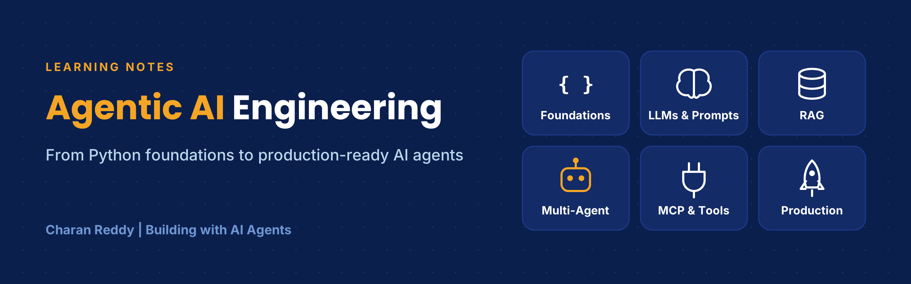
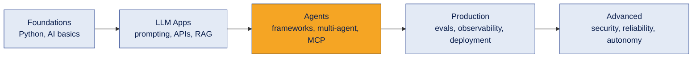

# Agentic AI Engineering Notes

A structured, beginner-friendly set of notes on **agentic AI engineering**: from Python foundations to building, evaluating and deploying AI agents.

I'm writing these as I learn. Every concept follows the same format so it's easy to study and revise:

> **What it is → How it works → Example → Where it's used → Common mistake → Interview questions → In one line**

Diagrams are written in [Mermaid](https://mermaid.js.org/), so GitHub draws them directly on the page.

---

## Who this is for
- Beginners moving into AI engineering from another field
- Developers who want a clear map of the agentic AI landscape
- Anyone preparing for junior AI / AI agent engineering interviews

## How to use these notes
1. Follow the topics **in order**: each one builds on the previous.
2. Read the diagram first, then the explanation and example.
3. Use the **interview questions** to test yourself before moving on.
4. Try the code examples yourself (Google Colab is enough to start).

---

## The learning path

---

## Topics

**Status:** ✅ Learned · 📘 Concepts learned, hands-on next · 🔜 Coming next

### Stage 1 · Foundations
| # | Topic | What's inside | Status |
|---|---|---|---|
| 01 | [Python for AI](01-python-for-ai/README.md) | Data types, collections, logic, functions, files, JSON, errors, debugging, classes | ✅ |
| 02 | [AI Foundations](02-ai-foundations/README.md) | AI → ML → DL → GenAI → agentic AI, tokens, embeddings, attention, transformers, agent loop, CoT, ReAct | ✅ |
| 03 | [GenAI Tech Stack](03-genai-tech-stack/README.md) | 4-layer stack, system-level thinking, infrastructure, observability, security, data, guardrails | ✅ |

### Stage 2 · Building LLM Applications
| # | Topic | What's inside | Status |
|---|---|---|---|
| 04 | [Prompt Engineering](04-prompt-engineering/README.md) | Prompt anatomy, context window, zero/one/few-shot, prompt debugging, structured reasoning | ✅ |
| 05 | LLM APIs and Tool Calling | Calling models from Python, API keys and `.env`, function calling, structured JSON output | 🔜 |
| 06 | [RAG](06-rag/README.md) | Loading, chunking, embeddings, vector databases, retrieval, grounding, RAG vs fine-tuning | 📘 |

### Stage 3 · Building Agents
| # | Topic | What's inside | Status |
|---|---|---|---|
| 07 | [Agent Frameworks](07-agent-frameworks/README.md) | LangChain, LangGraph, CrewAI, AutoGen, Agno: what each is and when to use it | 📘 |
| 08 | Multi-Agent Systems | Roles, orchestration patterns, serial vs parallel, memory and state, agentic RAG, A2A | 🔜 |
| 09 | Workflow Automation | n8n workflows with AI agents, triggers, integrations, human-in-the-loop flows | 🔜 |
| 10 | Model Context Protocol (MCP) | MCP servers and clients, tool schemas, secure tool hosting, connecting agents to tools | 🔜 |

### Stage 4 · Production
| # | Topic | What's inside | Status |
|---|---|---|---|
| 11 | Evaluating AI Agents | Test sets, LLM-as-judge, accuracy and faithfulness, regression testing | 🔜 |
| 12 | Observability and AgentOps | Tracing, logging, latency and cost tracking (LangSmith, Phoenix) | 🔜 |
| 13 | Agentic UX and Trust | Transparency, confidence, approvals and overrides, human-in-the-loop design | 🔜 |
| 14 | Deployment and LLMOps | FastAPI, Docker, cloud hosting, CI/CD basics, scaling and cost control | 🔜 |
| 15 | Metrics, ROI and Go-to-Market | Success metrics, ROI, pricing, launching AI products | 🔜 |

### Stage 5 · Advanced
| # | Topic | What's inside | Status |
|---|---|---|---|
| 16 | AI Security and Reliability | Prompt injection, red teaming, guardrails in code, fallbacks, access control | 🔜 |
| 17 | Autonomous AI Systems | Long-running agents, planning and self-correction, human oversight at scale | 🔜 |

---

## Projects

| Project | What it shows | Link |
|---|---|---|
| Analyzing Customer Orders | Python data analysis of customer orders and buying patterns | _(add repo link)_ |
| Text-Based Adventure Game | Python logic (variables, lists, loops, conditions, functions), built with GitHub Copilot | _(add repo link)_ |

Coming next: a RAG assistant, multi-agent systems and an end-to-end agent project.

---

## Good to know
- These are **learner's notes**. I verify concepts carefully, but tools and APIs change fast: always check the official documentation before relying on code examples.
- Interview questions are **commonly asked** at junior level; they are not guaranteed to appear in any specific interview.
- Found a mistake? Feel free to open an issue.

---

**Author:** D. Charan Baba Reddy · _(add LinkedIn link)_
