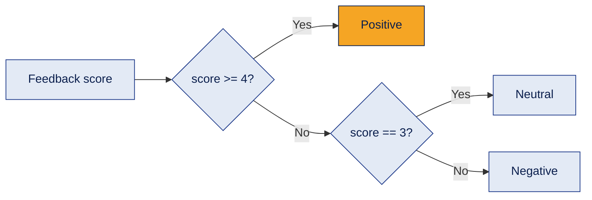
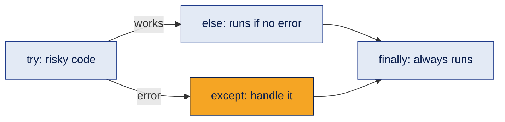
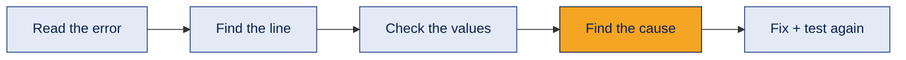
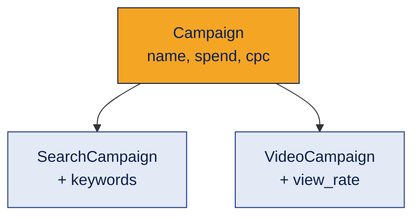

# 01 · Python for AI

The Python I use as a foundation for building AI agents. The goal is not to know every corner of Python it is to **read, write, modify and debug** the Python that AI systems are built with.

[← Back to all topics](../README.md)

## Contents
1. [Variables and data types](#1-variables-and-data-types)
2. [Strings and f-strings](#2-strings-and-f-strings)
3. [Lists, tuples, sets and dictionaries](#3-lists-tuples-sets-and-dictionaries)
4. [Conditions: if / elif / else](#4-conditions-if--elif--else)
5. [Loops and comprehensions](#5-loops-and-comprehensions)
6. [Functions](#6-functions)
7. [\*args and \*\*kwargs](#7-args-and-kwargs)
8. [Lambda, map, filter, reduce](#8-lambda-map-filter-reduce)
9. [File handling](#9-file-handling)
10. [JSON](#10-json)
11. [Error handling](#11-error-handling)
12. [Debugging](#12-debugging)
13. [Classes and objects](#13-classes-and-objects)
14. [Inheritance](#14-inheritance)
15. [What I'm learning next](#whats-next)

---

## 1. Variables and data types

**What it is**
A variable is a name that stores a value. The data type tells Python what kind of value it is.

**How it works**
```python
campaign = "Diwali Sale"   # str   – text
clicks = 1250              # int   – whole number
cpc = 4.75                 # float – decimal number
is_active = True           # bool  – True / False

print(type(cpc))           # <class 'float'>
budget = int("5000")       # type conversion: str -> int
```

**Example**
Storing one ad campaign's numbers before calculating its cost.

**Where it's used**
Everywhere. Agent settings (model name, temperature, max steps) are stored in variables.

**Common mistake**
Mixing types: `"Clicks: " + 1250` fails. Convert first (`str(1250)`) or use an f-string.

**Interview questions**
1. **Q:** What are Python's basic data types? **A:** `int`, `float`, `str`, `bool` (plus collections like `list`, `tuple`, `set`, `dict`).
2. **Q:** How do you check a variable's type? **A:** `type(x)`, or `isinstance(x, int)` to test it.
3. **Q:** What does `int("12.5")` do? **A:** It raises a `ValueError`. You need `float("12.5")` first, then `int()`.
4. **Q:** Is Python statically or dynamically typed? **A:** Dynamically typed — a variable's type is decided at runtime and can change.
5. **Q:** What naming style does Python use for variables? **A:** `snake_case` (e.g. `total_clicks`), as recommended by PEP 8.

**In one line**
Variables hold values; the data type decides what you can do with them.

---

## 2. Strings and f-strings

**What it is**
A string is text. An f-string inserts variables into text.

**How it works**
```python
brand = "GlowSkin"
spend = 2500

print(f"{brand} spent ₹{spend} today")    # GlowSkin spent ₹2500 today
print(brand.upper())                      # GLOWSKIN
print(brand[0:4])                         # Glow  (slicing)
print("  hello  ".strip())                # hello
print("good,bad,okay".split(","))         # ['good', 'bad', 'okay']
```

**Example**
Building a personalized message: `f"Hi {name}, your order {order_id} is on the way."`

**Where it's used**
**Prompts are strings.** f-strings are how agents insert user input, retrieved documents and tool results into a prompt.

**Common mistake**
Forgetting the `f` before the quotes — the text then shows `{name}` literally.

**Interview questions**
1. **Q:** Are strings mutable in Python? **A:** No, strings are immutable. Methods like `.upper()` return a new string.
2. **Q:** What is an f-string? **A:** A string prefixed with `f` that evaluates expressions inside `{}`.
3. **Q:** What does `.split()` return? **A:** A list of substrings.
4. **Q:** How do you reverse a string? **A:** `text[::-1]`.
5. **Q:** Difference between `.strip()` and `.replace()`? **A:** `.strip()` removes leading/trailing whitespace; `.replace(a, b)` swaps every `a` with `b`.

**In one line**
Strings are text; f-strings are how I build dynamic prompts.

---

## 3. Lists, tuples, sets and dictionaries

**What it is**
Four ways to store multiple values.

| Type | Syntax | Ordered | Changeable | Duplicates |
|---|---|---|---|---|
| List | `[1, 2, 3]` | Yes | Yes | Yes |
| Tuple | `(1, 2, 3)` | Yes | No | Yes |
| Set | `{1, 2, 3}` | No | Yes | No |
| Dictionary | `{"key": value}` | Yes (insertion order) | Yes | Keys must be unique |

**How it works**
```python
skills = ["Google Ads", "Meta Ads", "Python"]   # list
skills.append("LangChain")

location = (17.38, 78.48)                         # tuple – fixed pair

words = {"good", "great", "good"}                 # set -> {'good', 'great'}

customer = {"name": "Alice", "city": "Hyderabad"} # dictionary
print(customer["name"])                           # Alice
customer["plan"] = "Gold"                         # add a key
```

**Example**
A dictionary mapping each customer to their feedback: `{"Alice": "Great service", "Bob": "Late delivery"}`.

**Where it's used**
- **Dictionaries** look exactly like JSON — the format LLM APIs send and receive.
- **Lists** hold chat history, retrieved documents and agent steps.
- **Sets** remove duplicates and check membership fast.

**Common mistake**
Accessing a missing key with `customer["age"]` raises a `KeyError`. Use `customer.get("age")` to get `None` instead.

**Interview questions**
1. **Q:** Difference between a list and a tuple? **A:** Lists are mutable (can change); tuples are immutable (fixed).
2. **Q:** When would you use a set? **A:** To remove duplicates or check "is this item present?" quickly.
3. **Q:** How do you safely read a dictionary key that may not exist? **A:** `d.get("key", default)`.
4. **Q:** How do you loop over a dictionary's keys and values together? **A:** `for key, value in d.items():`.
5. **Q:** Can a list be a dictionary key? **A:** No — keys must be immutable (hashable). A tuple can be a key; a list cannot.

**In one line**
List = changeable order, tuple = fixed, set = unique, dict = key → value (like JSON).

---

## 4. Conditions: if / elif / else

**What it is**
Code that makes decisions based on whether something is true.

**How it works**

```python
score = 4
if score >= 4:
    label = "Positive"
elif score == 3:
    label = "Neutral"
else:
    label = "Negative"
```

**Example**
Refund ≤ ₹1,000 → auto-approve; above that → send to a human.

**Where it's used**
**Guardrails and business rules** in agents are often plain if/else  deterministic checks around a probabilistic model.

**Common mistake**
Using `=` (assign) instead of `==` (compare), or forgetting the indentation.

**Interview questions**
1. **Q:** Difference between `=` and `==`? **A:** `=` assigns a value; `==` compares two values.
2. **Q:** What are logical operators in Python? **A:** `and`, `or`, `not`.
3. **Q:** What values count as "falsy"? **A:** `False`, `0`, `""`, `None`, and empty collections like `[]` and `{}`.
4. **Q:** Can you write an if/else in one line? **A:** Yes: `label = "Pass" if score > 50 else "Fail"`.
5. **Q:** Difference between `==` and `is`? **A:** `==` compares values; `is` checks if two names point to the same object (use `is` for `None`).

**In one line**
Conditions let code choose a path the basis of every rule and guardrail.

---

## 5. Loops and comprehensions

**What it is**
Loops repeat code for each item. A comprehension builds a new list in one line.

**How it works**
```python
campaigns = ["Search", "Video", "Display"]

for c in campaigns:                 # for loop
    print(c)

attempts = 0
while attempts < 3:                 # while loop
    attempts += 1

cpcs = [12, 25, 8, 30]
expensive = [x for x in cpcs if x > 20]   # comprehension -> [25, 30]
```

**Example**
Looping over every customer's feedback and labeling each one.

**Where it's used**
The **agent loop** (think → act → observe → repeat) is a loop with a stopping condition. RAG loops over document chunks.

**Common mistake**
A `while` loop with no exit condition runs forever. Agents need a **max steps** limit for the same reason.

**Interview questions**
1. **Q:** Difference between `for` and `while`? **A:** `for` loops over a known sequence; `while` repeats until a condition becomes false.
2. **Q:** What do `break` and `continue` do? **A:** `break` exits the loop; `continue` skips to the next iteration.
3. **Q:** What is a list comprehension? **A:** A short way to build a list: `[expression for item in iterable if condition]`.
4. **Q:** How do you get both index and value while looping? **A:** `for i, item in enumerate(items):`.
5. **Q:** How do you loop over two lists together? **A:** `for a, b in zip(list1, list2):`.

**In one line**
Loops repeat work; comprehensions do it in one clean line.

---

## 6. Functions

**What it is**
A reusable block of code that takes inputs (parameters) and gives back an output (return value).

**How it works**
```python
def calculate_cpc(spend, clicks):
    """Return cost per click."""
    if clicks == 0:
        return 0
    return spend / clicks

print(calculate_cpc(2500, 500))   # 5.0
```

**Example**
One `classify_feedback(sentence)` function reused for thousands of reviews.

**Where it's used**
**Every agent tool is a function.** The LLM decides which function to call and with what inputs. The docstring often becomes the tool's description.

**Common mistake**
Printing instead of returning. `print()` shows a value; `return` hands it back so other code can use it.

**Interview questions**
1. **Q:** What does a function return if there's no `return`? **A:** `None`.
2. **Q:** Difference between a parameter and an argument? **A:** Parameter = the name in the definition; argument = the actual value passed in.
3. **Q:** What is a default parameter? **A:** A parameter with a preset value, e.g. `def greet(name="there"):`.
4. **Q:** What is a docstring? **A:** A string right under `def` that describes what the function does.
5. **Q:** What is variable scope? **A:** Where a variable is visible. Variables created inside a function are local to it.

**In one line**
Functions package logic for reuse and in agents, functions become tools.

---

## 7. \*args and \*\*kwargs

**What it is**
Ways to accept **any number** of inputs. `*args` collects extra positional values into a tuple; `**kwargs` collects extra named values into a dictionary.

**How it works**
```python
def total_spend(*amounts):
    return sum(amounts)

total_spend(500, 1200, 300)        # 2000

def create_campaign(name, **settings):
    print(name, settings)

create_campaign("Diwali", budget=5000, city="Hyderabad")
# Diwali {'budget': 5000, 'city': 'Hyderabad'}
```

**Example**
A report function that accepts any number of campaign names.

**Where it's used**
Framework code (LangChain, CrewAI) uses `**kwargs` heavily to pass optional settings through to models and tools.

**Common mistake**
Wrong order. Correct order is: normal params, `*args`, keyword params, `**kwargs`.

**Interview questions**
1. **Q:** What type is `args` inside the function? **A:** A tuple.
2. **Q:** What type is `kwargs`? **A:** A dictionary.
3. **Q:** Are the names `args` and `kwargs` required? **A:** No — the `*` and `**` matter; the names are convention.
4. **Q:** How do you unpack a list into function arguments? **A:** `func(*my_list)`; a dict into keyword arguments: `func(**my_dict)`.
5. **Q:** Why are they useful? **A:** They make functions flexible when the number of inputs isn't known in advance.

**In one line**
`*args` = any number of values, `**kwargs` = any number of named settings.

---

## 8. Lambda, map, filter, reduce

**What it is**
A lambda is a small one-line function without a name. `map`, `filter` and `reduce` apply a function across a collection.

**How it works**
```python
from functools import reduce

prices = [100, 250, 400]

with_tax = list(map(lambda p: p * 1.18, prices))        # apply to every item
big = list(filter(lambda p: p > 200, prices))           # keep matching items -> [250, 400]
total = reduce(lambda a, b: a + b, prices)               # combine into one -> 750
```

**Example**
Adding GST to every product price in one line.

**Where it's used**
Quick data cleaning before sending data to a model, and sorting results: `sorted(chunks, key=lambda c: c["score"], reverse=True)`.

**Common mistake**
Writing complex logic inside a lambda. If it needs more than one simple expression, write a normal function.

**Interview questions**
1. **Q:** What is a lambda function? **A:** An anonymous one-expression function: `lambda x: x * 2`.
2. **Q:** What does `map()` return in Python 3? **A:** A map object (an iterator). Wrap it in `list()` to see the values.
3. **Q:** Difference between `map` and `filter`? **A:** `map` transforms every item; `filter` keeps only items where the function returns True.
4. **Q:** Where is `reduce` imported from? **A:** `from functools import reduce`.
5. **Q:** What's often more readable than `map`/`filter`? **A:** A list comprehension.

**In one line**
Lambdas are tiny functions; map transforms, filter selects, reduce combines.

---

## 9. File handling

**What it is**
Reading from and writing to files so data survives after the program ends.

**How it works**
| Mode | Meaning |
|---|---|
| `"r"` | Read (file must exist) |
| `"w"` | Write (creates or **overwrites**) |
| `"a"` | Append (adds to the end) |

```python
with open("report.txt", "w") as f:        # 'with' closes the file automatically
    f.write("Alice - Positive\n")

with open("report.txt", "a") as f:
    f.write("Bob - Negative\n")

with open("report.txt", "r") as f:
    for line in f:
        print(line.strip())
```

**Example**
Saving a daily feedback report instead of losing it when the notebook closes.

**Where it's used**
Loading documents for RAG, saving agent logs, storing outputs.

**Common mistake**
Using `"w"` when you meant `"a"` — it silently erases the old content.

**Interview questions**
1. **Q:** Why use `with open(...)`? **A:** It closes the file automatically, even if an error happens.
2. **Q:** Difference between `"w"` and `"a"`? **A:** `"w"` overwrites the file; `"a"` adds to the end.
3. **Q:** What happens if you open a missing file with `"r"`? **A:** `FileNotFoundError`.
4. **Q:** Difference between `read()`, `readline()` and `readlines()`? **A:** Whole file as one string / one line / list of all lines.
5. **Q:** How do you check if a file exists? **A:** `os.path.exists(path)` or `pathlib.Path(path).exists()`.

**In one line**
Files make data permanent; always use `with`.

---

## 10. JSON

**What it is**
A text format for structured data. A Python dictionary converts directly to and from JSON.

**How it works**
```python
import json

customer = {"name": "Alice", "orders": 3, "vip": True}

with open("customer.json", "w") as f:
    json.dump(customer, f, indent=2)          # dict -> file

with open("customer.json") as f:
    data = json.load(f)                       # file -> dict

text = json.dumps(customer)                   # dict -> string
back = json.loads(text)                       # string -> dict
```

**Example**
Saving each support ticket as structured data: category, priority, customer ID.

**Where it's used**
**LLM APIs talk in JSON.** Tool calls, structured outputs and API responses are all JSON.

**Common mistake**
Mixing up `load`/`loads`: `load` reads from a **file**, `loads` reads from a **string** (the "s" = string).

**Interview questions**
1. **Q:** Difference between `json.load` and `json.loads`? **A:** `load` reads from a file; `loads` parses a string.
2. **Q:** What does `indent=2` do in `json.dump`? **A:** Formats the JSON with indentation so it's readable.
3. **Q:** What does Python's `True` become in JSON? **A:** `true` (and `None` becomes `null`).
4. **Q:** Can every Python object be saved as JSON? **A:** No — only basic types (dict, list, str, int, float, bool, None) by default.
5. **Q:** Why does JSON matter for AI agents? **A:** APIs, tool calls and structured LLM outputs all use JSON.

**In one line**
JSON is the language APIs and agents use to exchange data.

---

## 11. Error handling

**What it is**
Catching errors so the program responds sensibly instead of crashing.

**How it works**

```python
try:
    cpc = spend / clicks
except ZeroDivisionError:
    cpc = 0
    print("No clicks yet")
finally:
    print("CPC check done")
```

**Example**
An API call fails because the network drops catch it and retry instead of crashing.

**Where it's used**
Agents call external APIs and tools that **will** fail sometimes. Error handling + retry limits keep them running.

**Common mistake**
A bare `except:` that hides every error, including bugs. Catch specific errors.

**Interview questions**
1. **Q:** What is the purpose of `try/except`? **A:** To handle errors gracefully without crashing.
2. **Q:** When does `finally` run? **A:** Always whether an error happened or not.
3. **Q:** When does `else` run in a try block? **A:** Only if no exception occurred.
4. **Q:** How do you raise your own error? **A:** `raise ValueError("Budget must be positive")`.
5. **Q:** Why avoid a bare `except:`? **A:** It catches everything, hiding real bugs and making debugging harder.

**In one line**
Expect failures, catch specific errors, and keep the system running.

---

## 12. Debugging

**What it is**
Finding and fixing the cause of wrong behavior.

**How it works**

- **Read the traceback from the bottom** the last line is the error type and message.
- Print or inspect variable values at each step.
- Change **one thing at a time** and test again.

**Example**
`KeyError: 'email'` → the customer dictionary has no `email` key → use `.get("email")` or check the data source.

**Where it's used**
Reviewing AI-generated code. Copilot and chat tools write plausible code that can still be wrong debugging is how I verify it.

**Common mistake**
Rewriting everything randomly instead of finding the one real cause.

**Interview questions**
1. **Q:** Where do you look first in a traceback? **A:** The last line (error type and message), then the line number above it.
2. **Q:** Difference between a syntax error and a runtime error? **A:** Syntax errors stop the code from running at all; runtime errors happen while it runs.
3. **Q:** What are common Python errors? **A:** `SyntaxError`, `NameError`, `TypeError`, `KeyError`, `IndexError`, `ValueError`.
4. **Q:** How do you debug AI-generated code? **A:** Read it, run it with small test inputs, check outputs, and trace any error to its cause.
5. **Q:** What's better than `print` debugging in larger programs? **A:** A debugger (breakpoints in VS Code) and `logging`.

**In one line**
Read the error, find the cause, change one thing, test again.

---

## 13. Classes and objects

**What it is**
A class is a blueprint. An object is one real thing made from that blueprint, with its own data (attributes) and actions (methods).

**How it works**
```python
class Campaign:
    def __init__(self, name, spend, clicks):
        self.name = name          # attributes
        self.spend = spend
        self.clicks = clicks

    def cpc(self):                # method
        return self.spend / self.clicks if self.clicks else 0

diwali = Campaign("Diwali Sale", 2500, 500)
print(diwali.cpc())               # 5.0
```

**Example**
One `Campaign` blueprint, many campaign objects each with its own spend and clicks.

**Where it's used**
**LangChain, CrewAI and AutoGen are built on classes.** `Agent(...)`, `Task(...)` and `Crew(...)` all create objects.

**Common mistake**
Forgetting `self` as the first parameter of a method.

**Interview questions**
1. **Q:** Difference between a class and an object? **A:** A class is the blueprint; an object is an instance created from it.
2. **Q:** What is `__init__`? **A:** The constructor it runs when an object is created and sets its attributes.
3. **Q:** What is `self`? **A:** A reference to the current object, used to access its attributes and methods.
4. **Q:** Difference between an attribute and a method? **A:** Attribute = data; method = a function that belongs to the class.
5. **Q:** Name the four pillars of OOP. **A:** Encapsulation, abstraction, inheritance, polymorphism.

**In one line**
Classes are blueprints; agent frameworks are built from them.

---

## 14. Inheritance

**What it is**
A new class reuses and extends an existing class.

**How it works**

```python
class VideoCampaign(Campaign):
    def __init__(self, name, spend, clicks, views):
        super().__init__(name, spend, clicks)   # reuse parent setup
        self.views = views

    def view_rate(self):
        return self.clicks / self.views if self.views else 0
```

**Example**
`VideoCampaign` gets everything a `Campaign` has, plus video-only metrics.

**Where it's used**
Custom agents and tools often extend a framework's base class (for example, building a custom tool by inheriting from a base tool class).

**Common mistake**
Forgetting `super().__init__(...)`, so the parent's attributes are never set.

**Interview questions**
1. **Q:** What is inheritance? **A:** A child class reusing and extending a parent class's attributes and methods.
2. **Q:** What does `super()` do? **A:** Calls the parent class's methods, usually `__init__`.
3. **Q:** What is method overriding? **A:** A child class redefining a method that exists in the parent.
4. **Q:** Does Python support multiple inheritance? **A:** Yes — a class can inherit from more than one parent.
5. **Q:** Why use inheritance? **A:** To reuse code and avoid repeating the same logic in related classes.

**In one line**
Inheritance = reuse a parent class, add only what's new.

---

<a id="whats-next"></a>
## What I'm learning next
These are needed to connect Python to real AI services. **Not learned yet** — next on my list:
- `pip` and virtual environments (`venv`)
- `.env` files and keeping API keys secret
- `requests` and calling APIs
- Later: type hints, logging, Pydantic, async, FastAPI, pytest

[← Back to all topics](../README.md)
