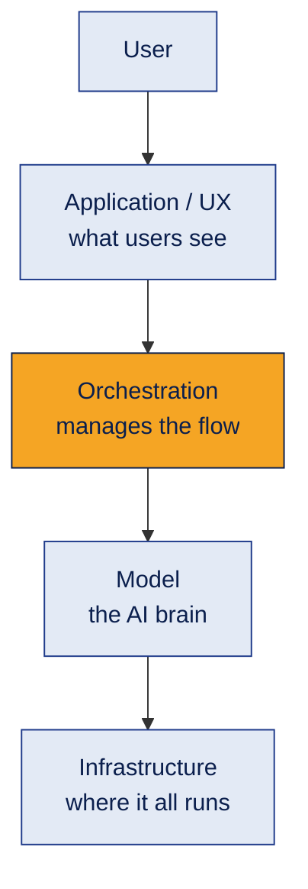
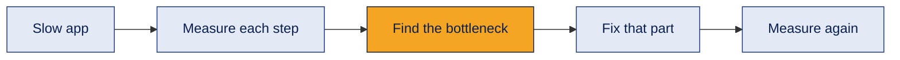
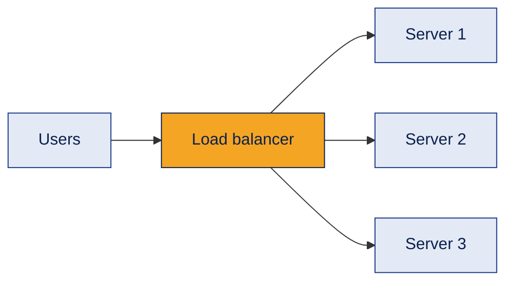
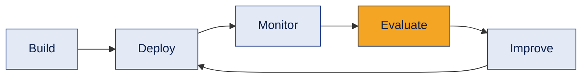
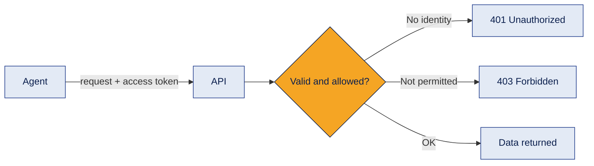
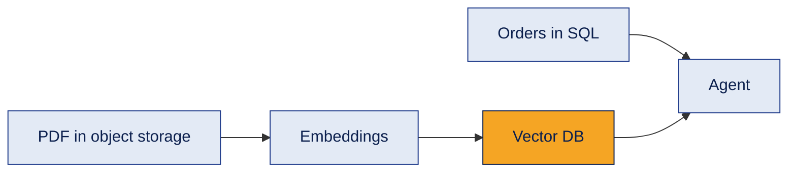
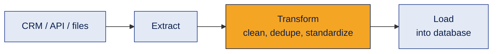
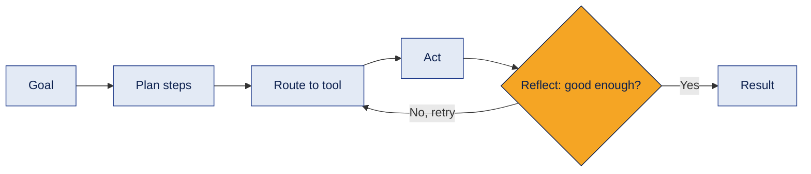
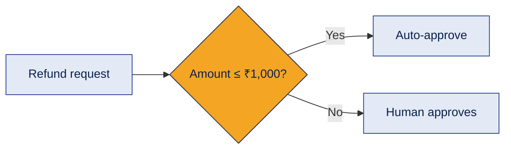

# 03 · GenAI Tech Stack

How a real AI product is built in layers — and why good AI engineering means thinking about the **whole system**, not just the model.

[← Back to all topics](../README.md)

## Contents
1. [The 4-layer GenAI stack](#1-the-4-layer-genai-stack)
2. [System-level thinking](#2-system-level-thinking)
3. [Infrastructure options](#3-infrastructure-options)
4. [Scaling, latency and reliability](#4-scaling-latency-and-reliability)
5. [Monitoring, observability and LLMOps](#5-monitoring-observability-and-llmops)
6. [Security: access tokens and least privilege](#6-security-access-tokens-and-least-privilege)
7. [Data types and storage](#7-data-types-and-storage)
8. [Data ingestion and ETL](#8-data-ingestion-and-etl)
9. [Orchestration: planning, routing, reflection](#9-orchestration-planning-routing-reflection)
10. [Guardrails and human-in-the-loop](#10-guardrails-and-human-in-the-loop)

---

## 1. The 4-layer GenAI stack

**What it is**
A way to split an AI system into four layers, each with one clear job.

**How it works**

| Layer | Job | Examples |
|---|---|---|
| Application / UX | The face of the system | Chat UI, website, WhatsApp bot, approval screen |
| Orchestration | The manager / traffic controller | LangChain, LangGraph, CrewAI, AutoGen, n8n |
| Model | The brain | GPT, Claude, Gemini, Llama, embedding models |
| Infrastructure | The foundation | Azure, AWS, GCP, GPUs, containers, storage |

**Example**
A support chatbot: the chat window (application) → LangGraph decides whether to search the FAQ or check an order (orchestration) → GPT writes the reply (model) → all hosted on Azure (infrastructure).

**Where it's used**
Designing, explaining and debugging any AI product. Agent frameworks live in the **orchestration** layer.

**Common mistake**
Thinking "AI product = the model". Most engineering work happens in orchestration, data and infrastructure.

**Interview questions**
1. **Q:** Name the four layers of the GenAI stack. **A:** Application/UX, orchestration, model, infrastructure.
2. **Q:** Which layer do LangChain and CrewAI belong to? **A:** Orchestration.
3. **Q:** What does the orchestration layer do? **A:** Coordinates prompts, tools, retrieval, memory, models, retries and approvals.
4. **Q:** Why separate a system into layers? **A:** Each layer can be changed, scaled or debugged independently — e.g. swap the model without rebuilding the UI.
5. **Q:** Where would you add human approval? **A:** Designed in orchestration, shown to the user in the application layer.

**In one line**
UX is the face, orchestration the manager, the model the brain, infrastructure the foundation.

---

## 2. System-level thinking

**What it is**
Understanding how every part of an AI system affects the final outcome — instead of optimizing only the model.

**How it works**

**Example**
A request takes 8 seconds: LLM = 1 s, vector search = 0.5 s, external API = 6 s. Buying a faster GPU would barely help — the **API** is the bottleneck.

**Decision checklist**
Quality · latency · cost · scale · reliability · security · region · vendor flexibility · user experience.

**Where it's used**
Choosing models, designing architecture, cutting costs, and fixing slow or unreliable systems.

**Common mistake**
"Use the biggest model." The right choice is the one that meets the quality bar at acceptable cost, speed and risk.

**Interview questions**
1. **Q:** What is system-level thinking? **A:** Optimizing the whole system end to end, not just one component like the model.
2. **Q:** An AI app is slow. What do you do first? **A:** Measure the time of each step to find the real bottleneck before changing anything.
3. **Q:** Is the biggest model always the best choice? **A:** No — it's slower and costlier; pick the smallest model that meets the quality requirement.
4. **Q:** What trade-offs matter when choosing a model? **A:** Quality, latency, cost, context size, data privacy, regional availability.
5. **Q:** How can a change in one layer affect the product? **A:** E.g. faster inference shortens queues, improving customer response time and satisfaction.

**In one line**
Measure first, find the bottleneck, then optimize the right component.

---

## 3. Infrastructure options

**What it is**
Where and how an AI system runs.

**How it works**
| Option | Meaning | Good for |
|---|---|---|
| Cloud | Rent infrastructure from a provider | Fast start, scaling |
| Self-hosted | Run it on your own servers | Full control, strict data rules |
| Hybrid | Cloud + on-premises together | Sensitive data stays inside |
| Multi-cloud | More than one cloud provider | Resilience, avoiding dependency |
| Edge | Run AI on the device itself | Low latency, privacy, offline use |

**Example**
A bank keeps customer data on its own servers but runs model inference in Azure — a **hybrid** setup.

**Vendor lock-in**
Becoming so dependent on one provider's APIs or services that switching later is expensive.

**Where it's used**
Architecture decisions, compliance (data must stay in a country), and cost planning.

**Common mistake**
Ignoring **region**: a model may not be available in every region, and data residency rules can require local processing.

**Interview questions**
1. **Q:** Difference between cloud and self-hosting? **A:** Cloud = rent and let the provider manage it; self-host = you run and manage the infrastructure.
2. **Q:** What is a hybrid setup? **A:** Combining on-premises systems with cloud services.
3. **Q:** What is edge AI and one limitation? **A:** Running AI on local devices; limited compute and memory, so large models are hard to run.
4. **Q:** What is vendor lock-in and how do you reduce it? **A:** Heavy dependence on one provider; reduce it with abstraction layers and portable designs.
5. **Q:** Why does the region of inference matter? **A:** It affects latency, data residency/compliance, availability and cost.

**In one line**
Where AI runs affects speed, cost, privacy and compliance.

---

## 4. Scaling, latency and reliability

**What it is**
Keeping a system fast and available as usage grows.

**How it works**

| Term | Meaning |
|---|---|
| Latency | Time for one request |
| Throughput | Requests handled per second/minute |
| Vertical scaling | Make one machine stronger |
| Horizontal scaling | Add more machines |
| Load balancing | Spread traffic across machines |
| Autoscaling | Add/remove capacity automatically with demand |
| Rate limiting | Cap requests per user or service |
| Failover | Switch to a backup when the main system fails |

**Example**
A festive-sale chatbot gets 10× traffic: autoscaling adds servers, the load balancer spreads requests, rate limits stop abuse.

**Where it's used**
Any AI product with real users. LLM APIs also have their own rate limits (requests and tokens per minute).

**Common mistake**
Confusing latency and throughput — a system can handle many requests (high throughput) while each one is still slow (high latency).

**Interview questions**
1. **Q:** Difference between latency and throughput? **A:** Latency = time per request; throughput = number of requests handled over time.
2. **Q:** Vertical vs horizontal scaling? **A:** Vertical = a bigger machine; horizontal = more machines.
3. **Q:** What is a load balancer? **A:** It distributes incoming traffic across multiple servers.
4. **Q:** Why use rate limiting? **A:** To protect the system and costs from overload or abuse.
5. **Q:** What is failover? **A:** Automatically redirecting to a backup system or region when the primary fails.

**In one line**
Scale out, spread the load, limit abuse, and always have a backup.

---

## 5. Monitoring, observability and LLMOps

**What it is**
- **Monitoring** tells you *something* is wrong.
- **Observability** helps you find *why*, using metrics, logs and traces.
- **LLMOps** is the practice of running LLM apps in production.

**How it works**

| Term | Meaning |
|---|---|
| Metrics | Numbers: latency, error rate, cost, token usage |
| Logs | Event records: "tool X failed at 10:42" |
| Traces | The step-by-step path of one request |
| Rollback | Return to the last stable prompt/model/version |
| Drift | Data or performance changing over time |

**Example**
Complaint classification accuracy drops after customers start using new slang — that's **drift**. Monitoring spots the drop; traces show which step fails; you update the prompt or examples.

**Where it's used**
Every production AI system. Tools: LangSmith, Phoenix (Arize), cloud monitoring.

**Common mistake**
Shipping an AI feature with no logging — when it fails, there's nothing to debug.

**Interview questions**
1. **Q:** Monitoring vs observability? **A:** Monitoring detects that something is wrong; observability helps explain why.
2. **Q:** What are the three main observability signals? **A:** Metrics, logs and traces.
3. **Q:** What is drift? **A:** When data, user behavior or model performance changes over time compared to what was expected.
4. **Q:** What is a rollback? **A:** Reverting to a previously stable version after a bad release.
5. **Q:** What would you track for an LLM app? **A:** Latency, error rate, token usage/cost, answer quality and user feedback.

**In one line**
Monitor to know it broke, observe to know why, roll back to recover.

---

## 6. Security: access tokens and least privilege

**What it is**
Controlling **who** a system is and **what** it is allowed to do.

**How it works**

- **Access token:** a temporary digital credential sent with each API request.
- **Token debugging** checks: present? expired? right issuer and audience? right permissions (scope)? right environment?
- **401** = who are you? (authentication). **403** = I know you, but you're not allowed (authorization).
- **Least privilege:** give an agent only the permissions it needs.

**Example**
A support agent can **read** order status ✅ but cannot **delete** accounts ❌ or approve large refunds ❌.

**Where it's used**
Every agent that touches company systems (CRM, databases, email, payments).

**Common mistake**
Giving an agent admin access "to make it work". If it's tricked by a prompt injection, it can do real damage.

**Interview questions**
1. **Q:** Authentication vs authorization? **A:** Authentication verifies who you are; authorization decides what you're allowed to do.
2. **Q:** Difference between 401 and 403? **A:** 401 = not authenticated; 403 = authenticated but not permitted.
3. **Q:** What is the principle of least privilege? **A:** Give each user or agent only the minimum permissions required.
4. **Q:** Where should API keys be stored? **A:** In environment variables or a secrets manager — never in code or GitHub.
5. **Q:** Why is least privilege extra important for AI agents? **A:** Agents can be manipulated (e.g. prompt injection), so limited permissions limit the damage.

**In one line**
Know who's calling, allow only what's needed.

---

## 7. Data types and storage

**What it is**
The three kinds of data AI systems use, and where each is stored.

**How it works**
| Data type | Meaning | Examples | Stored in |
|---|---|---|---|
| Structured | Organized facts | Orders, customers, payments | SQL databases (PostgreSQL, MySQL) |
| Unstructured | Content without fixed format | PDFs, emails, images, chats | Object storage (Azure Blob, S3) |
| Vector | Meaning as numbers | Embeddings of documents | Vector databases (Pinecone, Qdrant, pgvector) |

**Example**
"Where's my order and can I return it?" → order status from **SQL** (exact fact) + return policy from the **vector DB** (meaning search).

**Where it's used**
Choosing the right source for each question an agent receives.

**Common mistake**
Putting exact facts (prices, order status) only in a vector DB. Use SQL for exact facts; vectors for meaning.

**Interview questions**
1. **Q:** Structured vs unstructured data? **A:** Structured = organized rows/columns; unstructured = free-form content like PDFs and emails.
2. **Q:** What is object storage used for? **A:** Storing files: documents, images, videos.
3. **Q:** What does a vector database store? **A:** Embeddings plus the original text chunks and metadata, for similarity search.
4. **Q:** When would you query SQL instead of a vector DB? **A:** For exact facts like order status, totals or prices.
5. **Q:** Can one system use all three? **A:** Yes — most real agents combine SQL, files and vector search.

**In one line**
SQL = exact facts, object storage = files, vector DB = meaning.

---

## 8. Data ingestion and ETL

**What it is**
- **Ingestion:** bringing data into the system, in batches or in real time.
- **ETL:** Extract → Transform → Load.

**How it works**

**Example**
Every night: pull leads from the CRM → remove duplicates and fix phone formats → load into the analytics database.

**Where it's used**
Feeding clean data to agents and RAG systems. Bad data in = bad answers out.

**Common mistake**
Skipping the transform step. Duplicates and messy formats cause wrong answers that look like "AI mistakes".

**Interview questions**
1. **Q:** What does ETL stand for? **A:** Extract, Transform, Load.
2. **Q:** Batch vs real-time ingestion? **A:** Batch processes data on a schedule; real-time (streaming) processes it as it arrives.
3. **Q:** Give examples of the transform step. **A:** Removing duplicates, fixing formats, filling missing values, standardizing fields.
4. **Q:** Why does data quality matter for AI? **A:** The model can only be as good as the data it receives.
5. **Q:** Which tools can run simple ingestion pipelines? **A:** n8n, Python scripts, cloud data services.

**In one line**
Extract the data, clean it, load it — garbage in, garbage out.

---

## 9. Orchestration: planning, routing, reflection

**What it is**
Three abilities that make agents work:
- **Planning:** what steps should I take?
- **Tool routing:** which tool fits this step?
- **Reflection:** was the result good enough?

**How it works**

**Routing examples**
| Question | Tool |
|---|---|
| "What was last month's revenue?" | SQL database |
| "What's our refund policy?" | Document search (RAG) |
| "What's the competitor's latest price?" | Web search |
| "Send the report" | Email API |
| "What's 18% GST on ₹4,999?" | Calculator / code |

**Example**
Goal "compare suppliers": plan (get list → prices → delivery data → compare) → route each step → reflect on missing data → recommend.

**Where it's used**
Every agent framework: LangGraph nodes, CrewAI tasks, AutoGen conversations.

**Common mistake**
No stop condition. Reflection without max retries, timeouts and cost limits can loop forever.

**Interview questions**
1. **Q:** What is planning in an agent? **A:** Breaking a goal into ordered steps.
2. **Q:** What is tool routing? **A:** Choosing the right tool or data source for each step.
3. **Q:** What is reflection? **A:** The agent evaluating its result and deciding to accept, retry, use another tool, or stop.
4. **Q:** How do you stop reflection loops? **A:** Max steps, max retries, timeouts, cost budgets and a clear stop condition.
5. **Q:** What helps an LLM route to the right tool? **A:** Clear tool names and descriptions, and well-defined inputs.

**In one line**
Plan the steps, route each to the right tool, reflect before finishing.

---

## 10. Guardrails and human-in-the-loop

**What it is**
- **Guardrails:** rules that control what an AI system can accept, do and say.
- **Human-in-the-loop (HITL):** a human must approve before an important action.
- **Human-on-the-loop:** the AI acts, a human supervises and can step in.

**How it works**

**Types of guardrails**
Input (block harmful or off-topic requests) · output (check before showing) · tool (limit what tools can do) · permission (who can access what) · business rules (refund limits, discounts).

**Example**
An agent drafts a LinkedIn post automatically, but a human approves it before publishing.

**Where it's used**
Finance, legal, healthcare, sensitive communications, irreversible actions, low-confidence answers.

**Common mistake**
Relying only on the prompt ("please don't do X") as a guardrail. Important rules should also be enforced in code.

**Interview questions**
1. **Q:** What are guardrails? **A:** Controls that restrict or validate an AI system's inputs, outputs and actions.
2. **Q:** Human-in-the-loop vs human-on-the-loop? **A:** In-the-loop = a human must approve; on-the-loop = AI acts while a human supervises.
3. **Q:** When should a human approve an agent's action? **A:** For high-risk, irreversible, financial or low-confidence decisions.
4. **Q:** Name types of guardrails. **A:** Input, output, tool, permission and business-rule guardrails.
5. **Q:** Why isn't a system prompt enough as a guardrail? **A:** Prompts can be ignored or bypassed (e.g. prompt injection); critical rules need code-level enforcement.

**In one line**
Let AI move fast, but put rules and humans where mistakes are costly.

[← Back to all topics](../README.md)
